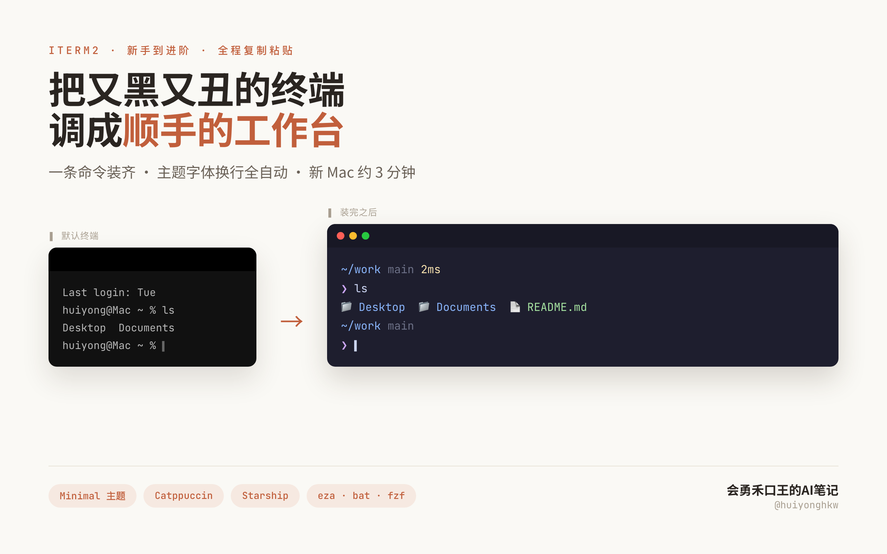
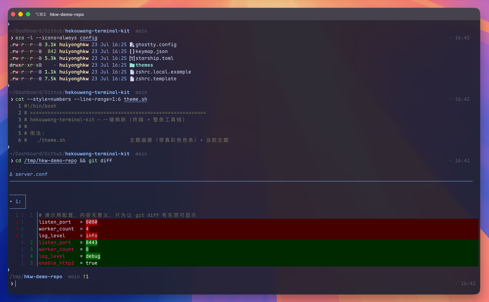
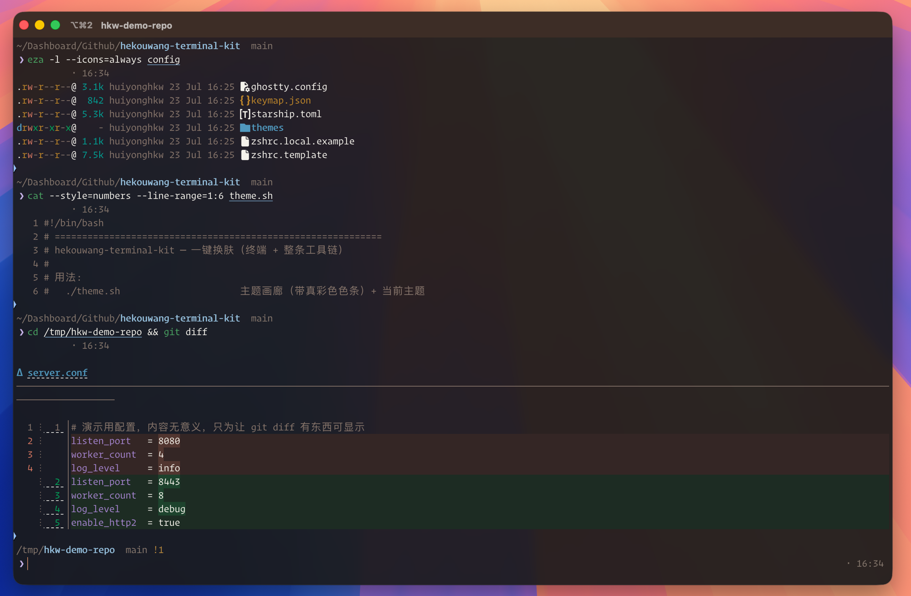
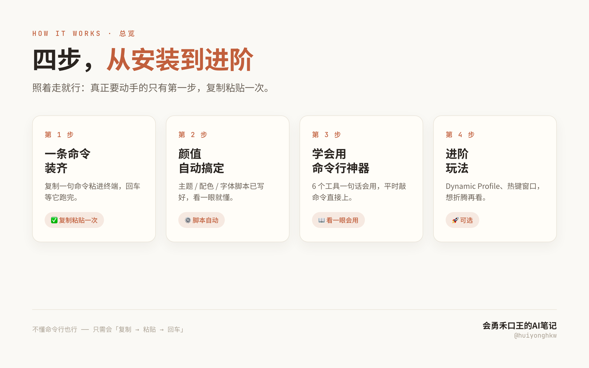
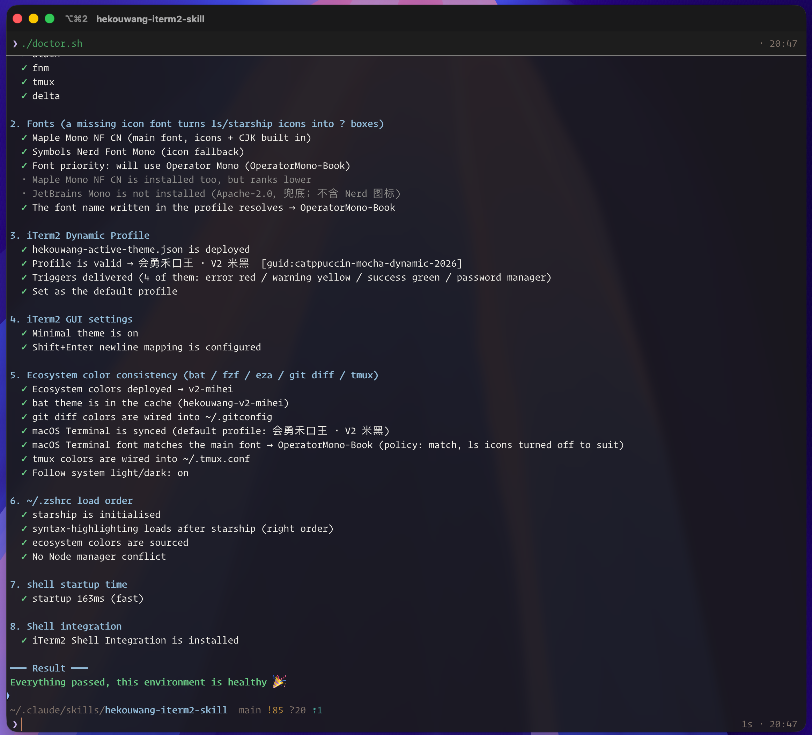
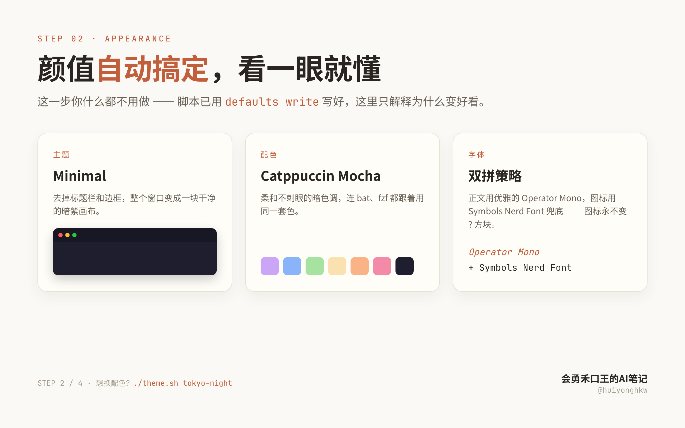
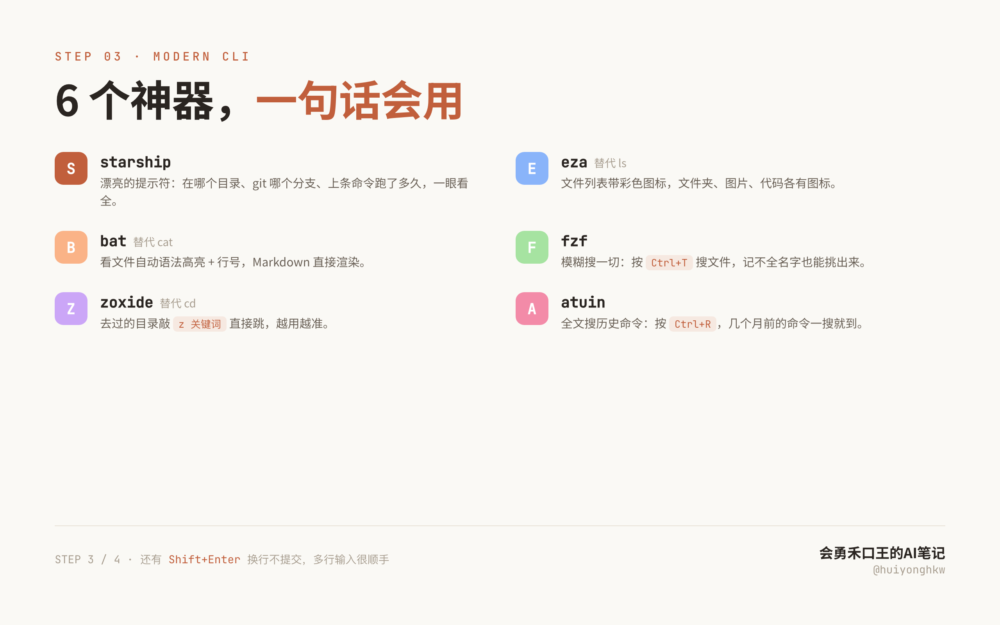
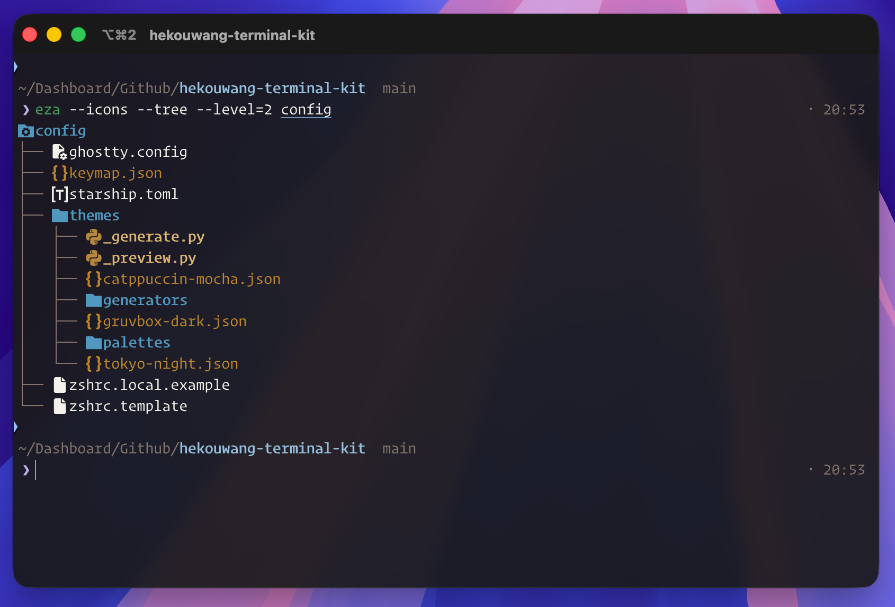

<h1 align="center">OneLook</h1>

<p align="center">
  <b>同色 → 同观感。</b>敢装敢卸，一份色板。<br>
  <code>hekouwang-terminal-kit</code>
</p>

<p align="center">
  如果你在终端、主题、CLI 工具之间来回折腾，而它们各自一套颜色，
  <b>OneLook</b> 把一份色板做成统一观感 —— 而且敢装也敢卸。
</p>

<p align="center">
  <a href="README.md">English</a> · <a href="README.zh-CN.md">简体中文</a>
  · <a href="https://huiyonghkw.github.io/hekouwang-terminal-kit/guide/index.html?lang=zh"><b>文档站</b></a>
  · <a href="https://huiyonghkw.github.io/hekouwang-terminal-kit/?lang=zh">落地页 / 购买</a>
</p>

<p align="center">
  
  
  
  
</p>

### 文档（与文档站同一张地图）

| | |
|---|---|
| [安装](https://huiyonghkw.github.io/hekouwang-terminal-kit/guide/install.html?lang=zh) | 安装、迁移、预演、国内镜像 |
| [换肤与跟随](https://huiyonghkw.github.io/hekouwang-terminal-kit/guide/theme.html?lang=zh) | `theme.sh`、钉住与跟随系统、fzf + ANSI 预览 |
| [四终端](https://huiyonghkw.github.io/hekouwang-terminal-kit/guide/terminals.html?lang=zh) | iTerm2 · Ghostty · Warp · 自带终端 |
| [Node 管理器](https://huiyonghkw.github.io/hekouwang-terminal-kit/guide/node.html?lang=zh) | fnm / nvm / brew / vfox —— 四选一 |
| [语义交互层](https://huiyonghkw.github.io/hekouwang-terminal-kit/guide/semantic.html?lang=zh) | Cmd-click 路径:行号 / SHA / 端口 |
| [体检与卸载](https://huiyonghkw.github.io/hekouwang-terminal-kit/guide/doctor.html?lang=zh) | `--status` 仪表盘、卸载、备份 |
| [CLI 索引](https://huiyonghkw.github.io/hekouwang-terminal-kit/tools/index.html?lang=zh) · [主题画廊](https://huiyonghkw.github.io/hekouwang-terminal-kit/themes/index.html?lang=zh) · [更新日志](https://huiyonghkw.github.io/hekouwang-terminal-kit/changelog.html?lang=zh) | |

> **开源版**＝配好的 iTerm2（3 套社区配色、毛玻璃、Triggers、语义 Cmd-click、CLI、体检）。
> **付费版**＝让这份色板走到 **Ghostty · Warp · 自带终端** + 工具链 + Skill。
> 文档站把免费用法写全；付费只写「是什么 / 为什么买」。见[四终端](https://huiyonghkw.github.io/hekouwang-terminal-kit/guide/terminals.html?lang=zh)。

<p align="center">
  
</p>

---

## 同一台机器，同一条命令，只差一个档位

<table>
<tr>
<th width="50%">开源版（免费）</th>
<th width="50%">付费版</th>
</tr>
<tr>
<td></td>
<td></td>
</tr>
</table>

一条命令都没变：`eza` 列目录、`cat` 看代码、`git diff` 看改动。

左边不是「配色难看」——Monokai 是经典，delta 的红绿是出厂设置。
问题是**三个工具各说各的**，还跟终端底色不搭。右边四样是**同一份色板生成的**，所以是一家人。

我交过学费：手工维护的 Warp 主题，注释写着「与 iTerm2 完全一致」，实际 **16 个色槽错了 8 个**。

只用 iTerm2 → 免费版就够用（好看 + AI 细节 + 敢卸）。
还用 Ghostty / Warp / 自带终端，或想让 `cat`/`ls`/`git diff` 跟终端同色 → 付费档解决的是「一份色板走出去」。

---

## 一、你可能正在经历的

自从用上 Claude Code 这类 CLI agent，我每天泡在终端里的时间大概翻了一倍。

以前终端是「敲两条命令就切走」的地方。现在它是我和 AI 一起干活的主界面：四个 tab 同时跑着四个任务，输出哗哗往上刷，我得一眼看出哪个报错了、哪个跑完了、哪个还在转。

然后我发现，自己那套用了五年的终端配置，是给「敲命令」设计的，不是给「看 AI 干活」设计的：

- 四个 tab 长得一模一样，切过去半天认不出哪个在跑什么
- agent 吐几百行日志，`ERROR` 和正常输出一个颜色，全靠肉眼扫
- 想给 AI 写个多行 prompt，回车直接就提交了
- 白天靠窗、开会投屏，一片深色底什么都看不清
- 好不容易调顺手，换台电脑全没了，又得从头点一遍

这套配置就是冲着这些来的。**凡是能用 AI 干的活，我先跑通，再演给你看**——这套终端是我自己每天在用的那一套，不是拿来演示的。

## 二、跟网上那些 dotfiles 有什么不一样

1. **一份色板，管到四个终端**〔付费〕。别家换主题只换一个终端的底色。这里 `./theme.sh` 一条命令，iTerm2、Ghostty、Warp、**macOS 自带终端**四个一起换，连 `cat`（bat）、`Ctrl+T`（fzf）、`ls`（eza）、`git diff`（delta）、tmux、VS Code 全部同色——因为它们的配色是**同一份色板生成的**，不是各写一遍。
2. **为 AI 工作流准备的那几处细节**〔开源版就有〕。`Shift+Enter` 换行不提交；`ERROR/WARN/SUCCESS` 自动标色；**Cmd-click** `path:line` / Git SHA / `localhost:port`；`Password:` 提示弹密码管理器；跟随系统深浅色自动换肤〔付费〕。
3. **敢装，也敢卸**〔开源版就有〕。`install.sh --dry-run` 先列清要改什么；已有 `.zshrc` 用 `migrate.sh` 搬进 `~/.zshrc.local` 再套模板；后悔了 `uninstall.sh` 从备份还原。
4. **体检能自己修**〔开源版就有〕。`doctor.sh --status` 一眼看钉住状态；`--fix` 逐项确认后自动修；`--profile` 点名拖慢启动的插件（我机器上揪出过 `compinit`，258ms）。
5. **它是一个 Claude Code Skill**〔付费〕。装进 `~/.claude/skills/` 之后，你说「换个亮色」「终端怎么这么慢」，AI 自己挑脚本、跑完、解释结果——**你描述要什么，不用记怎么做**。

装完你会得到：

- **好看**：无边框无滚动条、毛玻璃、双行提示符；暗色亮色各有主题
- **好用**：`ls` 带图标、`cat` 自动高亮、`Ctrl+R` 全文搜历史、`z` 一个词跳目录
- **省心**：所有设置都写进文件，**换新电脑跑一遍脚本就全回来**

> 完全不懂命令行也没关系：你只需要会「复制 → 粘贴 → 回车」。

---

## 三、免费版 / 付费版

两条轴：

1. **色板走多远** —— 免费版让你的 iTerm2 好看；付费版让这份色板**走出 iTerm2**。
2. **谁在开车** —— 免费版你自己敲 `./theme.sh`、`./doctor.sh --fix`；付费版装进 Skill 后，跟 AI 说话它自己跑。

开源版不是演示版：3 套配色、毛玻璃、日志自动标色、`Shift+Enter`、现代 CLI、能自动修的体检、一键卸载，**脚本一个不少**。第二条轴买的不是功能，是「不用记命令」。

| | 开源版（MIT · 免费） | 付费版 ¥19.9 |
|---|---|---|
| 安装 / 迁移 / 换肤 / 体检 / 更新 / 同步 / 卸载 全套脚本 | ✅ | ✅ |
| Minimal：无标题栏 · 无边框 · 无滚动条 · 毛玻璃 · Triggers · 语义 Cmd-click · Shift+Enter | ✅ | ✅ |
| 现代 CLI 全家桶 · `doctor.sh --status/--fix/--profile` · `.zshrc` 迁移 | ✅ | ✅ |
| **配色主题** | 3 套社区 | + 4 套品牌（含 **2 套亮色**） |
| **Claude Code Skill** | — | ✅ |
| **多终端同步**（Ghostty · Warp · 自带终端）+ **全生态同色**（bat/fzf/eza/git diff/tmux/VS Code） | — | ✅ |
| 跟随系统深浅色 · 项目 tab 变色 · 色板推导 / 导入 · A4 速查卡 | — | ✅ |
| 更新与答疑 | GitHub Issues | 一年内更新 + 群内答疑 |

**付费卖的是三件事**：品牌四套主题、「一份色板管住整条工具链」的生成器、把这套教会 AI 的 Skill。

**想要付费版** → [购买页](https://huiyonghkw.github.io/hekouwang-terminal-kit/)（¥19.9，七天不合用直接退）
或微信 **`hekouwang`**（备注「终端套装」）。先装开源版用两天再决定完全可以。

<details>
<summary>付费版怎么拿、怎么装（两条路）</summary>

**路一 · zip 包**（默认，不需要 GitHub 账号）

```bash
cd ~/hekouwang-terminal-kit
./unlock.sh ~/Downloads/hekouwang-terminal-kit-付费包-*.zip
```

**路二 · private 仓**（会用 git 更省事）

买完把 GitHub 用户名发我，加入 `hekouwang-terminal-kit-pro` 后：

```bash
git clone git@github.com:huiyonghkw/hekouwang-terminal-kit-pro.git
cd hekouwang-terminal-kit-pro && ./install.sh
```

私有仓是免费仓的超集，clone 一个就够。买家首页与用法见付费仓 / 付费包内 README（不在本开源仓）。
</details>

文件级分档、品牌主题怎么推出来的 → [`docs/manual.zh-CN.md`](docs/manual.zh-CN.md) 第三节

---

## 四、装

<p align="center">
  
</p>

### 前置

1. 一台 Mac（Apple 芯片或 Intel）
2. 能联网（国内见下方 `CN=1`）
3. 会打开「终端」：`Command + 空格` → `Terminal`。第一次在自带终端里装，装完改用 iTerm2

### 先分清你是哪种情况

| 你的情况 | 用哪个 |
|---|---|
| 新 Mac，或从来没配过 `~/.zshrc` | `./install.sh` |
| **已经在用自己的 `.zshrc`** | 先 `./migrate.sh` |

`install.sh` 会**覆盖** `~/.zshrc`（先备份）。用了几年的配置请走迁移：把 alias/PATH 搬进 `~/.zshrc.local` 再套模板。

```bash
./migrate.sh            # 先看报告
./migrate.sh --apply    # 确认后再执行
```

### 开装

```bash
# 从 GitHub
git clone https://github.com/huiyonghkw/hekouwang-terminal-kit.git
cd hekouwang-terminal-kit

./install.sh --dry-run    # 先看：改哪些文件、写哪些设置、什么绝对不碰
./install.sh
```

国内网络卡住（`portable-ruby` / `SSL_ERROR_SYSCALL`）：

```bash
CN=1 ./install.sh
```

跑的时候大致是：Homebrew → iTerm2 + 字体 → CLI → oh-my-zsh → 主题（**全生态同色属付费档**）→ `.zshrc` → GUI 三项设置 → 自检。

跑完看到 `✅ 全部完成！`，最后会自动跑 `doctor.sh`：

<p align="center">
  
</p>

> ⚠️ 这张图是**付费档**机器，「全生态同色」那节全绿。**开源版那一节不会全绿，不是装坏了**——缺了不报警。开源版看第 1～4、6～8 节绿即可。

**关掉自带终端，打开 iTerm2**。脚本幂等，重跑安全。

---

## 五、装完为什么就好看了

<p align="center">
  
</p>

这一步你不用做——脚本已经用 `defaults write` 写好了：

1. **主题 = Minimal**：无标题栏、无边框、无滚动条，整窗一块画布 + 毛玻璃
2. **配色**：明度按 WCAG 对比度反解（正文 5.5:1 / 强调 9:1），克制且读得清
3. **字体 = Maple Mono NF CN**（开源默认）：等宽 + Nerd Font 图标 + 中文；**本套装不分发任何字体文件**。付费版另有字体优先级表，能自动用上你已装的 Operator Mono 等

---

## 六、每天用的那几个命令

<p align="center">
  
</p>

| 工具 | 一句话 | 怎么用 |
|---|---|---|
| **starship** | 漂亮的提示符 | 目录 / git 分支 / 上条命令耗时 |
| **eza**（替代 `ls`） | 文件列表带彩色图标 | 直接敲 `ls` |
| **bat**（替代 `cat`） | 看文件自动高亮 + 行号 | 直接敲 `cat 文件名` |
| **delta**（替代 git diff） | diff 带语法高亮 | 直接敲 `git diff` |
| **fzf** | 模糊搜一切 | `Ctrl+T` 搜文件，`Alt+C` 模糊 cd |
| **zoxide**（替代 `cd`） | 一个词跳目录 | `z 关键词` |
| **atuin** | 全文搜历史 | `Ctrl+R` |

给 AI 用的一条：**`Shift + Enter` 换行不提交**——写多行 prompt 很顺手。

<p align="center">
  
</p>

全部快捷键 → [`references/shortcuts.md`](references/shortcuts.md)

---

## 七、换肤

```bash
./theme.sh                 # 主题画廊（真彩色 16 色条）
./theme.sh tokyo-night     # 切主题（开源版：3 套社区色）
./theme.sh --preview NAME  # 先预览、不换肤
```

开源版切的是 **iTerm2**（Dynamic Profile，保存即生效）。
付费版同一条命令还会带走 Ghostty / Warp / 自带终端，以及 bat / fzf / eza / git diff / tmux / VS Code——**同一份色板生成，不是各写一遍**。

付费另有：`./theme.sh --auto` 跟随系统深浅色；项目工作区（`cd` 进项目 tab 变色）；色板推导 / 导入现成主题。用法见付费包买家首页与 [`docs/manual.zh-CN.md`](docs/manual.zh-CN.md) 第七、八节。

---

## 八、维护：体检 / 更新 / 卸载

```bash
./doctor.sh            # 体检（第 0 节＝状态机仪表盘）
./doctor.sh --status   # 只看仪表盘：主题 / 跟随 / Node / 语义 / Ghostty 重载
./doctor.sh --fix      # 逐项确认后自动修
./doctor.sh --profile  # 启动慢？点名是哪个插件

./update.sh            # 更新（git 安装）
./sync.sh              # 多机思路见手册

./uninstall.sh         # 从备份还原 + GUI 恢复出厂
./uninstall.sh --dry-run
```

装完把个人 alias / PATH 写进 `~/.zshrc.local`（模板会自动加载），别改会被覆盖的模板段。

---

## 九、进阶与常见问题

tmux `-CC`、Triggers、**语义交互层**（Cmd-click）、Shell Integration、多终端差异、完整 FAQ（字体变 `?`、换肤后 `cat` 没变色、`cat | head` 验色陷阱等）→

**[`docs/manual.zh-CN.md`](docs/manual.zh-CN.md)**（English: [`docs/manual.md`](docs/manual.md)）· 文档站深链：[语义交互层](https://huiyonghkw.github.io/hekouwang-terminal-kit/guide/semantic.html?lang=zh)

| 其他 | 去哪 |
|---|---|
| 快捷键 | [`references/shortcuts.md`](references/shortcuts.md) |
| 更新记录 | [`CHANGELOG.md`](CHANGELOG.md) |
| English | [`README.md`](README.md) |

## License

开源版 [MIT](LICENSE.txt)。付费件另见付费包内授权说明。
