<h1 align="center">hekouwang-terminal-kit</h1>

<p align="center">
  <b>The terminal deserves one more round of setup in the AI era.</b><br>
  The free build makes your iTerm2 look right.<br>The paid build makes that same palette walk out of iTerm2 — four terminals and the whole command-line tool chain change together.
</p>

<p align="center">
  <i>hekouwang's AI notes · Not whether AI will replace you — how the people already using it will</i>
</p>

<p align="center">
  <a href="manual.md">English</a> · <a href="manual.zh-CN.md">简体中文</a>
</p>

<p align="center">
  
  
  
  
</p>

<p align="center">
  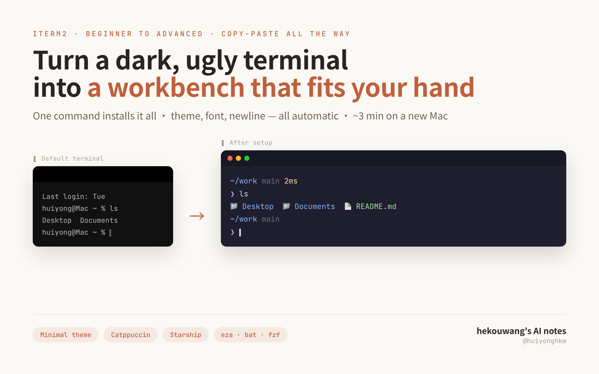
</p>

> Everything you run — installer, theme switcher, doctor, uninstaller — speaks English by
> default; `--lang zh` switches it (and everything after) to Chinese.

---

> **Full manual** (former README body). For a quick start see [`README.md`](../README.md) at the repo root.


## Same machine, same command — the only difference is the tier

<table>
<tr>
<th width="50%">Open source (free)</th>
<th width="50%">Paid</th>
</tr>
<tr>
<td></td>
<td></td>
</tr>
</table>

Not one command changed: `eza` lists the directory, `cat` reads the code, `git diff` shows the changes.

The left side is **not "ugly colors"** — Monokai is a classic scheme, and delta's red/green is its factory setting. The problem is that **three tools each speak their own dialect**: one palette for `eza`, a magenta one for `bat`, pure red and green for `git diff` — and none of them match the terminal background. On the right, all four are **generated from the same palette**, so they are family.

### Which of these you are decides what this is worth to you

**① You only use iTerm2 — what you get is "nothing jars"**

It is a subtle difference, subtle enough that **you notice its absence and not its presence**. The image above was shot for you: you do not need to know anything about color theory, just look at what jars on the left. Eight hours a day in a terminal and that difference adds up.

**② You use Ghostty / Warp / the built-in macOS Terminal — what you get is "they speak the same language as iTerm2"**

Let me be straight about this first: **Ghostty ships 463 themes of its own** (catppuccin, gruvbox, nord, dracula are all in there), one line of `theme = catppuccin-mocha` and you have them, for free. So what is being sold here is **not** "give Ghostty themes".

What is being sold is what those 463 cannot do: **they only cover Ghostty**. Ghostty has no idea which theme your iTerm2 uses, and cares even less about `cat`, `ls`, `git diff` or `tmux`. Change your scheme and you go change each of them by hand.

`./theme.sh v2-mihei`, one command: **four terminals plus the whole tool chain, one palette, all at once.** The pair below is Ghostty, running the same three commands:

<table>
<tr>
<th width="50%">Free: Ghostty does its own thing</th>
<th width="50%">Paid: the same palette as iTerm2</th>
</tr>
<tr>
<td>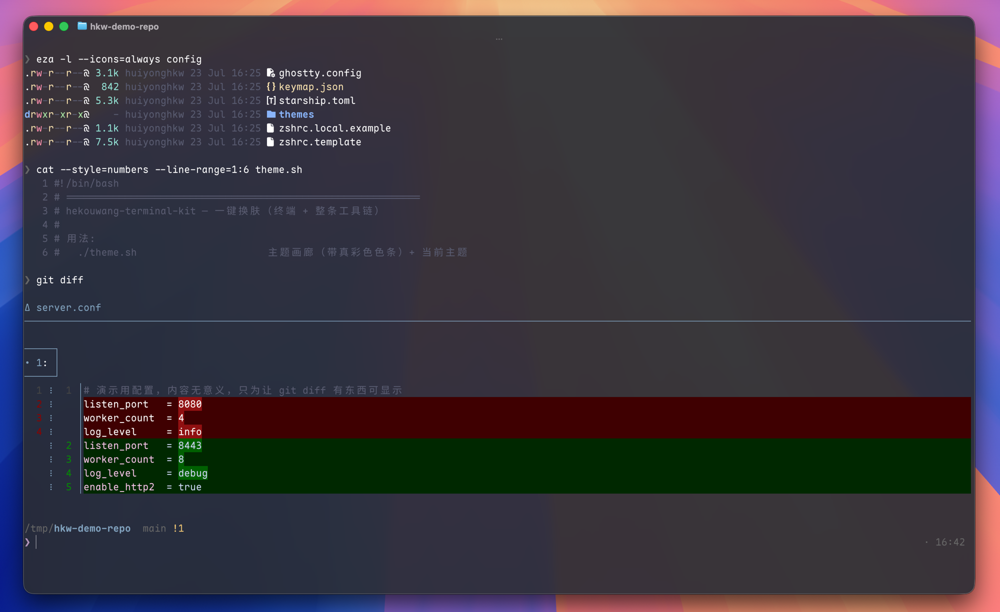</td>
<td>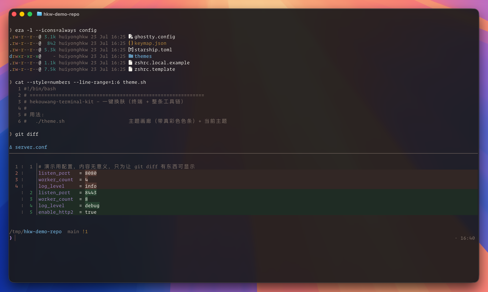</td>
</tr>
</table>

That patch of harsh pure red and green on the left is what "every tool with its own palette" looks like.

> All four shots come from the same machine, the same command and the same demo repo.
> Theme, font, tool-chain colors and Ghostty theme are aligned on **all four axes** by tier.
> Neither side got special treatment.

---

## 1. What you may be going through

Since I started living in CLI agents like Claude Code, the time I spend in a terminal has roughly doubled.

A terminal used to be somewhere I typed two commands and left. Now it is the main interface where the AI and I work together: four tabs running four tasks, output scrolling past, and I need to see at a glance which one errored, which finished, which is still spinning.

Then I noticed my own five-year-old terminal config was designed for *typing commands*, not for *watching an AI work*:

- Four tabs look identical, and after switching I cannot tell which is running what
- An agent dumps hundreds of log lines, `ERROR` is the same color as normal output, and I scan for it by eye
- I want to write a multi-line prompt for the AI, and Enter submits it immediately
- Sitting by a window during the day, or presenting in a meeting, a dark background shows nothing
- I finally get it comfortable, switch machines, and it is all gone — time to click through the settings again

This setup exists for exactly those. **Anything AI can do, I run for real first and then show you** — this terminal is the one I use every day, not a demo.

## 2. How this differs from the dotfiles repos out there

1. **One palette, four terminals** 〔paid〕. Other setups reskin one terminal's background. Here `./theme.sh` is one command, and iTerm2, Ghostty, Warp and **the built-in macOS Terminal** change together, along with `cat` (bat), `Ctrl+T` (fzf), `ls` (eza), `git diff` (delta), tmux and VS Code — because their colors are **generated from one palette** rather than written out several times. Hand-maintaining several palettes always drifts, and I paid that tuition with measurements: a Warp theme I maintained by hand carried a comment saying "identical to the iTerm2 one" while 8 of its 16 slots were actually wrong.
2. **The details built for AI workflows** 〔in the free build〕. `Shift+Enter` inserts a newline instead of submitting (multi-line prompts); `ERROR/WARN/SUCCESS` get colored automatically in the output, in colors that follow the theme; a `Password:` prompt pops your password manager; the theme follows the system light/dark switch, so presenting in daylight needs no manual change.
3. **Safe to install, safe to remove** 〔free build〕. `install.sh --dry-run` tells you which files it will touch, which system settings it will write, and what it will never go near. Already have your own `.zshrc`? `migrate.sh` moves your aliases and PATH into `~/.zshrc.local` and then lays down the template, instead of overwriting you. Changed your mind? `uninstall.sh` restores from the backup and resets the GUI settings to factory defaults.
4. **A checkup that can fix itself** 〔free build〕. `doctor.sh` does not only report: `--fix` fixes each item after you confirm it, and `--profile` names the plugin making your terminal slow to open (on my own machine it caught `compinit`, 258ms).
5. **It is a Claude Code Skill** 〔paid〕. Other dotfiles repos hand you a pile of scripts and a README, and the commands are yours to memorise. Drop this into `~/.claude/skills/` and you say "I am presenting in daylight, give me a light theme" or "why is this terminal so slow to open" — the agent picks the script, sets the flags, runs it and explains the result. **You describe the outcome; you do not memorise how it gets there.**

When it is done you get:

- **Good looking**: no border, no scrollbar, blur, a two-line prompt; themes for dark and light
- **Good to use**: `ls` with icons, `cat` with highlighting, `Ctrl+R` full-text history search, `z` to jump by one word
- **Low maintenance**: every setting lives in a file, so **a new machine is one script run away**

> Not knowing the command line is fine: all you need is copy → paste → Enter.

---

## 3. Free build / paid build

Two axes:

1. **How far the palette travels** — the free build makes your iTerm2 look right; the paid build makes that
   palette **walk out of iTerm2**: Ghostty, Warp, the built-in Terminal, `cat`, `git diff`, tmux and VS Code all follow.
2. **Who is driving** — in the free build you type `./theme.sh v2-mibai` and `./doctor.sh --fix` yourself;
   in the paid build you drop the directory into `~/.claude/skills/` and say "switch me to a light theme",
   "why does my terminal take so long to open" — **the agent picks the script, sets the flags, runs it and reads the result back to you**.

The open-source build is not a demo: 3 color schemes, blur, automatic log coloring, `Shift+Enter`, the modern CLI set, a checkup that can fix things, and an uninstaller that lets you change your mind — all in.
**Every script is there and every flag is unchanged** — what the second axis buys is not a feature, it is not having to remember the commands.

| | Open source (MIT · free) | Paid ¥19.9 |
|---|---|---|
| Install / migrate / theme / doctor / update / sync / uninstall / GUI setup / tiered export — all scripts | ✅ | ✅ |
| Minimal window: no title bar · no border · no scrollbar · unlimited scrollback | ✅ | ✅ |
| **Color themes** | ✅ 3 community (catppuccin-mocha / tokyo-night / gruvbox-dark) | ✅ the 3 community ones **+ 4 brand themes** |
| **Texture**: blur · transparency · cursor shape | ✅ | ✅ |
| **Triggers**: ERROR/WARN/SUCCESS coloring + password manager | ✅ 4 of them | ✅ |
| **`Shift+Enter` newline** (multi-line prompts for AI CLIs) | ✅ | ✅ |
| Modern CLI set · doctor `--fix`/`--profile` · `.zshrc` migration · one-command uninstall | ✅ | ✅ |
| Theme generator (write a palette, get a complete iTerm2 theme) | ✅ | ✅ |
| **Claude Code Skill**: drop it into `~/.claude/skills/` and an agent drives the whole kit — "switch me to a light theme", "why does my terminal take so long to open" | — | ✅ |
| **Brand themes** | — | V2 Warm Dark · V1 Tech Dark · **V2 Warm Light** · **V3 Finance Light** |
| **Light themes** (daylight / presenting / recording / outdoors) | — | ✅ two of them |
| **Multi-terminal sync**: Ghostty · Warp · the built-in Terminal | — | ✅ one command, four terminals |
| **Whole ecosystem in one color**: bat · fzf · eza · git diff · tmux · VS Code | — | ✅ |
| **Font priority table**: picks up commercial fonts you already own, e.g. Operator Mono | uses the recommended default | ✅ |
| **Follows the system light/dark switch** (`./theme.sh --auto`) | — | ✅ |
| **Project workspaces**: `cd` into a project and the tab recolors and prints its name | — | ✅ |
| **Palette deriver**: give it one brand color, get a whole theme | — | ✅ unlimited themes |
| **Import existing themes**: Ghostty's 463 / iTerm2-Color-Schemes' 450+, one command | — | ✅ imported ones cover the whole tool chain too |
| **Printable A4 cheat sheet** (PDF) | — | ✅ |
| Updates and support | GitHub Issues | ✅ a year of updates + group support |

**Why the line sits there**: the 3 community schemes are other people's open-source work, so charging for them would not stand up; blur and Triggers are what make a terminal worth screenshotting, and hiding them would stop the free build from doing its job as an advertisement. **What is sold is the three things I made myself** — four themes derived from brand tokens, the generator behind "one palette drives the whole tool chain", and **the Skill that teaches an agent to use all of it** (every workflow, every pitfall, every judgement call written out, so it knows which script to run with which flags and how to read the output without you explaining). Colors can be swapped and code can be rewritten; all three of those were paid for in time.

**To buy** → **[huiyonghkw.github.io/hekouwang-terminal-kit](https://huiyonghkw.github.io/hekouwang-terminal-kit/)** — ¥19.9, a year of free updates plus support, **seven-day no-questions refund**. Installing the open-source build first and deciding two days later is perfectly fine — it is not a trial, it is a complete product you can keep using forever without paying.

> Payment currently goes through WeChat Pay (WeChat **`hekouwang`**, mention "terminal kit"). **If you are outside China and have no WeChat Pay**, card payment is not set up yet — email **huiyonghkw@gmail.com** and we will sort something out; you get the same zip and the same year of updates.

**How the split is done technically** (out in the open, no unlock codes):

| Free (in the open-source repo) | Paid (in the paid pack) |
|---|---|
| `_generate.py` — the complete iTerm2 theme (colors + texture + Triggers + status bar) | `generators/pro.py` — multi-terminal + ecosystem generator |
| `palettes/community.py` — 3 community palettes | `palettes/brand.py` — 4 brand palettes |
| `config/keymap.json` — global key map | `config/font.conf` — font priority table |
| | `palettes/_derive.py` — palette deriver |
| | `palettes/_import.py` — theme import engine |
| | `SKILL.md` / `SKILL.zh-CN.md` — the Claude Code Skill |

With the paid files absent, the generator **still produces the complete iTerm2 theme** and simply prints "the following belong to the paid pack and are not generated" — no errors, no half-built state.

The four brand themes are not a few colors somebody liked. They are derived from brand tokens by a method: hue from the token, lightness solved backwards from WCAG contrast (5.5:1 for body, 9:1 for emphasis), saturation set by each version's character, and the ANSI values of both light themes **computed rather than picked**.

<details>
<summary>How to get and install the paid build (two routes, pick one)</summary>

**Route 1 · zip (default, no GitHub account needed)**

```bash
cd ~/hekouwang-terminal-kit
./unlock.sh ~/Downloads/hekouwang-terminal-kit-*.zip
```

One command: verify integrity → unpack → regenerate every theme → redeploy (building the bat cache on the way). To see what it would do first, add `--dry-run`. To install without switching theme, add `--no-apply`.

**Route 2 · private repo (easier if you use git)**

After buying, send me your GitHub username (WeChat `hekouwang`) and I add you as a collaborator on the private `hekouwang-terminal-kit-pro`. Then:

```bash
git clone git@github.com:huiyonghkw/hekouwang-terminal-kit-pro.git
cd hekouwang-terminal-kit-pro && ./install.sh
# later, to update:
git pull && cd config/themes && python3 _generate.py && cd ../.. && ./theme.sh v2-mihei
```

The private repo is a **superset of the free one** — cloning it is enough, you do not also need the free repo.

> The first switch to a given theme pauses a few seconds to build the bat cache. That is normal and cannot be skipped: when bat cannot find a theme it does not error, it silently uses its own default colors (which shows up as "only `cat` has the wrong colors").
</details>

---

## 4. Installing

### 4.1 Three prerequisites

1. **A Mac** (Apple silicon or Intel, the scripts detect it).
2. **A working network connection**. On a Chinese network GitHub may be unreachable; there is a dedicated section at the end of this part.
3. **Knowing how to open Terminal**: press `Command + Space`, type `Terminal`, press Enter. Do the first install in that built-in terminal; afterwards you switch to iTerm2.

<p align="center">
  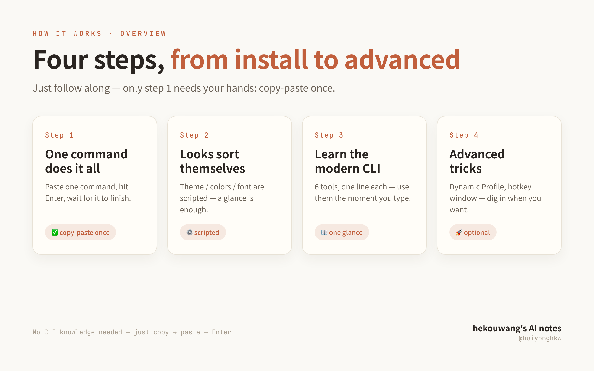
</p>

**How to read this document**: section 4 to install, sections 6 and 7 for daily use, section 8 for AI workflows, sections 9 and 12 when something breaks, the rest as needed.

---

<p align="center">
  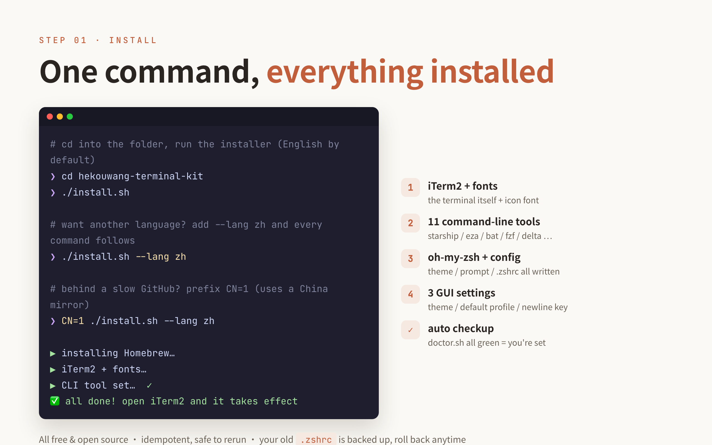
</p>

### 4.2 First, which case are you

| Your situation | Use |
|---|---|
| New Mac, or you never configured `~/.zshrc` | `./install.sh` |
| **Already using your own `.zshrc`** (accumulated aliases / PATH / work env vars) | `./migrate.sh` first |

`install.sh` **replaces** `~/.zshrc` with the template (after backing it up). If you have used yours for years, replacing it loses everything at once — recoverable from the `.bak`, but only line by line, by hand. That is what `migrate.sh` is for: it picks out what is yours, moves it into `~/.zshrc.local` (which the template loads automatically), and then lays down the template.

```bash
./migrate.sh            # the report first: what moves, what gets dropped, and why
./migrate.sh --apply    # once it looks right
```

### 4.3 Install

```bash
# Case A: you have a zip
unzip hekouwang-terminal-kit-*.zip -d ~/hekouwang-terminal-kit
cd ~/hekouwang-terminal-kit && ./install.sh

# Case B: from GitHub
git clone https://github.com/huiyonghkw/hekouwang-terminal-kit.git
cd hekouwang-terminal-kit && ./install.sh
```

**Not sure yet? Dry-run it.** It lists what it would install, which files it would write, which system settings it would change and what it never touches — without moving a single byte:

```bash
./install.sh --dry-run
```

The first interactive run also asks once whether you want English or Chinese and remembers the answer. You can change it any time with `./install.sh --lang zh`, or per command with `HKW_LANG=zh ./theme.sh`.

### 4.4 On a Chinese network: prefix with `CN=1`

Inside China without a VPN, installing usually stalls on downloads (`portable-ruby`, `SSL_ERROR_SYSCALL` and friends). **Use this instead** and it switches to domestic mirrors (Tsinghua TUNA + gitee):

```bash
CN=1 ./install.sh
```

### 4.5 What is it doing while it runs?

> Homebrew → iTerm2 + fonts → CLI tools → oh-my-zsh → theme and colors (**whole-ecosystem color is paid-tier**) → bat themes → wire into git/tmux → editor theme → `.zshrc` → Shell Integration → system settings → import history → **write the three GUI settings** → checkup report

When you see `✅ All done!` it worked. It finishes by running `doctor.sh`, and **all green means you are installed**:

<p align="center">
  
</p>

> ⚠️ This shot was taken on a **paid-tier** machine, which is why the eight lines under
> section 5 ("whole ecosystem in one color") are green. **On the open-source build that
> section will not be all green, and nothing is broken** — multi-terminal and whole-ecosystem
> color belong to the paid pack, and `doctor.sh` deliberately does not treat them as faults.
> For the open-source build, sections 1–4 and 6–8 green is what "installed" looks like.

**Close the built-in Terminal and open iTerm2** to see the new setup.

> 💡 The script is idempotent and safe to re-run; `~/.zshrc` is backed up to `~/.zshrc.bak.<timestamp>` before being replaced.

---

## 5. Why it looks right afterwards

<p align="center">
  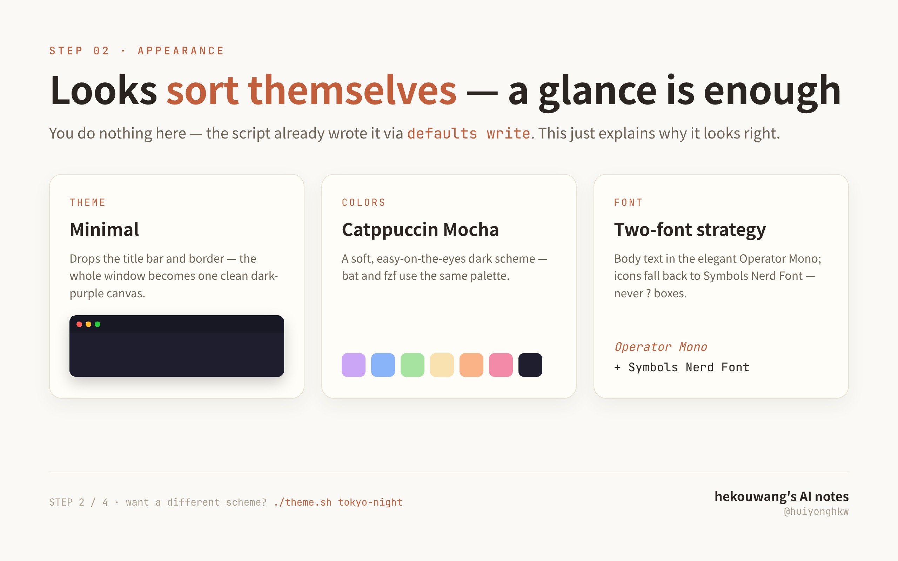
</p>

**You do nothing in this step** — the three places you used to click through in the settings panel are already written with `defaults write`:

1. **Theme = Minimal**: no title bar, no border, no scrollbar; the window is one clean canvas with a touch of blur.
2. **Colors**: not a community theme copied in — hue comes from the brand palette and lightness is solved backwards from WCAG contrast (5.5:1 body, 9:1 emphasis), so it stays restrained and still reads clearly.
3. **Font = Maple Mono NF CN** (recommended default): monospaced, **with Nerd Font icons and monospaced CJK built in**, so one font replaces the old "main font + icon font" pair and `ls` icons never turn into `?` boxes.
   > Licensing: Maple Mono is SIL OFL-1.1, **free to use commercially and to redistribute**. Older versions bundled Operator Mono (an H&Co commercial font, redistributed by a third-party repo); that was removed in 2.0 — **this kit distributes no font files at all**.
   > The paid build adds a [font priority table](#fonts-uses-what-you-have-installs-nothing) that picks up commercial fonts you already installed, such as Operator Mono. The open-source build always uses the recommended default.

---

## 6. The handful of commands you use daily

<p align="center">
  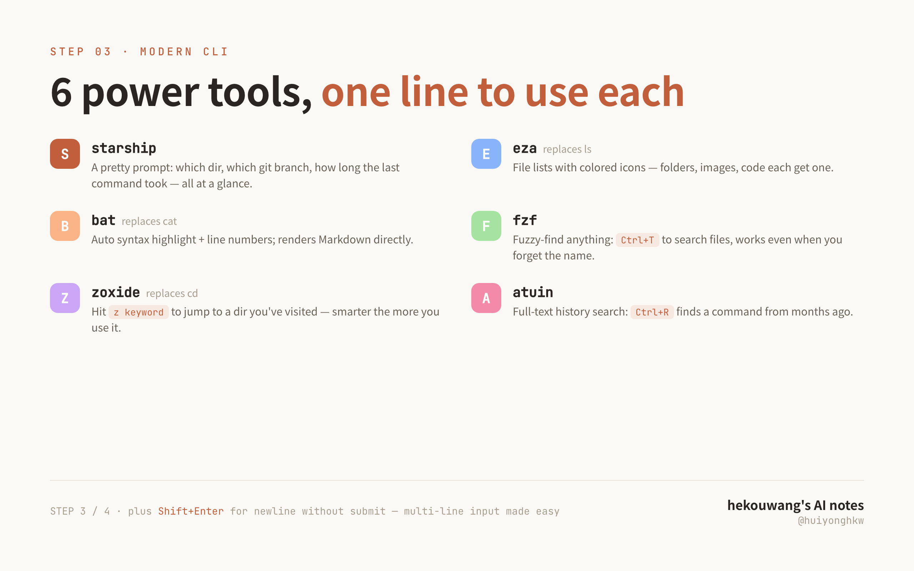
</p>

| Tool | In one line | How to use it |
|---|---|---|
| **starship** | A prompt worth looking at | Shows automatically: which directory, which git branch, how long the last command took |
| **eza** (replaces `ls`) | File listings with colored icons | Just type `ls` |
| **bat** (replaces `cat`) | Syntax highlighting and line numbers | Just type `cat <file>` |
| **delta** (replaces git's diff) | Diffs with highlighting and line numbers | Just type `git diff` |
| **fzf** | Fuzzy-find anything | `Ctrl+T` for files, `Alt+C` to fuzzy cd |
| **zoxide** (replaces `cd`) | Jump by one word | `z keyword`, and it gets better as you use it |
| **atuin** | Full-text history search | `Ctrl+R`, finds things you typed months ago |

Plus one for the AI: **`Shift + Enter` inserts a newline instead of submitting** — handy for multi-line input in tools like Claude Code.

<p align="center">
  
</p>

> Full keyboard shortcuts in [`references/shortcuts.md`](../references/shortcuts.md); the paid build adds a printable A4 cheat sheet.

---

## 7. Switching themes: one command, four terminals plus the tool chain

```bash
./theme.sh                      # gallery: one row per theme, true-color swatches, current one marked
./theme.sh tokyo-night          # switch
./theme.sh --preview v2-mihei   # do not switch, just look at it (a whole fake terminal)
./theme.sh --gallery            # render all seven in turn
```

`--preview` renders a full block: prompt, `eza` listing, `git diff`, syntax highlighting and ERROR/WARN coloring in a single image. It paints in 24-bit true color, **independent of the theme your terminal is currently using** — so picking a theme does not mean switching first, and taking screenshots does not mean reskinning seven times.

Switch once and all of the following become the same palette **at the same time**:

| Layer | What changes |
|---|---|
| **iTerm2** | Dynamic Profile (live on save, no restart) + font |
| **Ghostty** | theme file + the `theme=` line + font (including `font-style`) |
| **Warp** | Same theme, same colors, switched by `./theme.sh` itself (it edits `~/.warp/settings.toml`; restart Warp if you see no change) |
| **The built-in macOS Terminal** | A generated profile written into `com.apple.Terminal` and set as default, with 16 colors + font + transparency |
| **bat** | `cat` syntax highlighting |
| **fzf** | `Ctrl+T` popup colors |
| **eza / ls** | File listing colors (`LS_COLORS` + `EZA_COLORS`) |
| **delta** | `git diff` add/remove backgrounds, line numbers, file headers |
| **tmux** | Status bar, borders, message line |
| **VS Code / Cursor** | A matching theme extension (including the terminal panel's 16 colors) |

> starship is not in the table because it already follows along — its styles use ANSI color names (`blue`/`purple`/`bright-black`), so a theme switch reaches it automatically. Generating hex would pin it down instead.

**What cannot be synced** (these are iTerm2-only, the other terminals have no equivalent): Triggers (log coloring / password prompts), Dynamic Profile hot reload, the toolbelt, and native tmux `-CC` mapping.

### Fonts: uses what you have, installs nothing

Fonts go through the **priority table** in `config/font.conf` 〔paid〕. At deploy time it detects which of them are actually installed and takes the first hit — and writes that same result into iTerm2, Ghostty and the built-in Terminal.

```
OperatorMono-Book|Operator Mono|Book|H&Co commercial font, license must be bought
MapleMono-NF-CN-Regular|Maple Mono NF CN||SIL OFL-1.1, free for commercial use, icons + CJK
JetBrainsMono-Regular|JetBrains Mono||Apache-2.0, fallback
```

**This kit distributes no font files.** If you bought a commercial font like Operator Mono (about $199) and installed it, it gets used automatically; if you did not, it falls back to Maple Mono NF CN. To use a different font, add a line at the top of the table and re-run `./theme.sh`.

> Why detect instead of hard-coding a name: when the font name is wrong, both iTerm2 and Ghostty **silently fall back to a system font** without an error. Section 2 of `./doctor.sh` tells you which font actually ends up in use and whether the name written in the profile resolves at all.
> Also: the two apps name things differently — iTerm2 wants the PostScript name (`OperatorMono-Book`), Ghostty wants the family name (`Operator Mono`) plus `font-style`. The table keeps both columns; do not copy one into the other.

### Following the system light/dark switch <sub>(works out of the box in the paid build)</sub>

```bash
./theme.sh --auto                        # default pair (dark → V2 Warm Dark, light → V2 Warm Light)
./theme.sh --auto v1-keji v3-caijing-bai # your own pair
./theme.sh --auto off                    # turn it off
```

How it works: macOS writes `~/Library/Preferences/.GlobalPreferences.plist` when the appearance changes, so a launchd agent watching that file is enough. Light theme at sunset, and presentations follow the system without you touching anything.

### Adding your own theme

Edit a palette under `config/themes/palettes/` and re-run `python3 _generate.py`; every artifact is regenerated. **Never hand-edit the generated JSON / YAML / tmTheme** — the next run wipes it.

Create `palettes/mine.py` with a `PALETTES = {...}` in it and it is discovered automatically:

```python
PALETTES = {
    "my-theme": {
        "display": "My Theme",           # English name, baked into the artifacts
        "display_zh": "我的主题",         # optional Chinese name, injected at deploy time
        "light": False,
        "bg": "1a1a1a", "fg": "eeeeee", "cursor": "ff8800",
        "selbg": "333333", "selfg": "eeeeee",
        "ansi": [...16 hex values...],   # black red green yellow blue magenta cyan white ×2
    },
}
```

---

## 8. Three things built for AI workflows <sub>(paid)</sub>

All three come from the same scene: **four tabs running four agents at once**.

### Project workspaces: tell at a glance which tab runs what

```bash
./workspace.sh add ~/code/my-project    # register
./workspace.sh                          # list what is registered
./workspace.sh remove my-project        # unregister
```

Once registered, `cd` into that directory and **the tab recolors itself**, with the project name printed in the top right of the window.

The colors are not arbitrary — they rotate through the bright row of the current palette, so they always stay in the same family, and a theme switch regenerates the variants without re-registering anything. Each variant overrides only 3 identity keys and inherits everything else from the theme.

> It is built on iTerm2's Automatic Profile Switching. ⚠️ Two prerequisites: (1) Shell Integration is installed (`install.sh` does that; APS reports the path through it); (2) iTerm2's automatic-switching master switch is on — `./workspace.sh` checks both for you and prints the command to enable it.

### Palette deriver: give it one color, get a whole theme

```bash
./palette.sh --from "#e08a5f" --name mytheme --preset editorial
./palette.sh --from "#1a73e8" --name finance-light --light --preset data
```

It is not a color picker; it is **the method behind the four brand themes**, turned into code: hue from your brand color, lightness solved **backwards** from WCAG contrast (normal 5.5:1 / bright 9:1), saturation set by character, neutral greys locked to one hue.

The result is a `palettes/<name>.py`; re-run the generator and you get the full set — multi-terminal and whole tool chain included. So what the paid build gives you is not "4 themes" but **unlimited themes plus a reusable method**.

---

## 9. Maintenance: checkup / update / multi-machine / uninstall

### Checkup and self-repair

```bash
./doctor.sh              # read-only, gives a ✓/✗/⚠ list with fixes
./doctor.sh --fix        # asks about each fix (telling you the exact command first)
./doctor.sh --profile    # terminal slow to open? names the plugin eating the time
```

It covers: whether the CLI tools are present, whether the font **actually resolves** (a wrong name makes iTerm2 fall back silently, invisible to the eye), whether the Dynamic Profile is valid and its Guid unique, the GUI settings, whether **the whole ecosystem really matches**, the `.zshrc` load order, Node manager conflicts, and **shell startup time** (median of 7 runs).

---

### Updating

```bash
./update.sh --check   # is there a new version, and what changed? (touches nothing)
./update.sh           # pull → regenerate themes → redeploy the current theme
```

### Multiple machines

```bash
./sync.sh             # is this machine still identical to the repo (read-only)
./sync.sh --pull      # pull the drifted files back into line
./sync.sh --export    # build a package for a second machine
```

### Uninstalling

```bash
./uninstall.sh --dry-run   # see what it plans to remove
./uninstall.sh             # restore, confirming item by item
```

**The four rules of `uninstall.sh`** (it and `install.sh` are a pair):

1. It only removes what this kit installed. Homebrew itself, oh-my-zsh, your `~/.zshrc.local` and your own git/ssh config are never touched unless you explicitly say so.
2. `~/.zshrc` is **restored** from the backup rather than deleted; if no backup exists it says so instead of pretending it worked.
3. iTerm2's GUI settings go back to **factory defaults** via `defaults delete`, not to "the default we think is right" — that would just be meddling in another direction.
4. It prints the list before removing anything, and `--dry-run` prints exactly the same list.

---

## 10. Going further (optional)

<p align="center">
  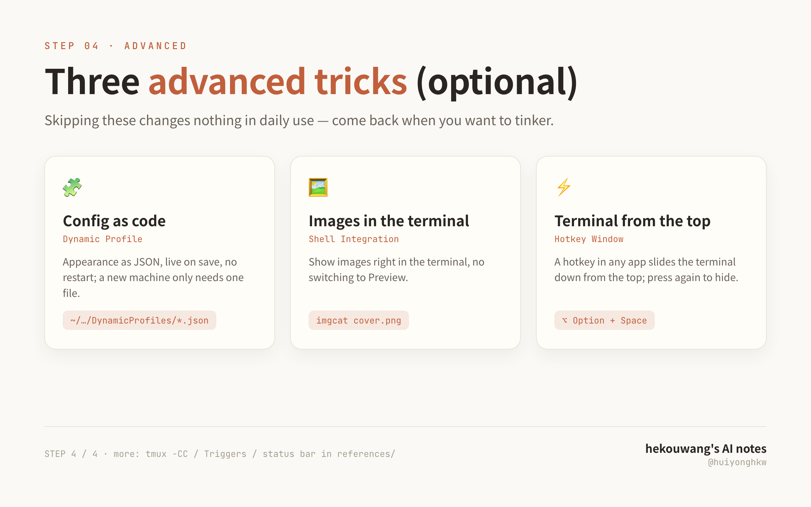
</p>

- **Dynamic Profile (config as code)**: iTerm2's appearance as JSON, live on save, no restart; a new machine only needs this file.
- **Hotkey Window**: press a hotkey in any app and the terminal slides down from the top of the screen; press again and it goes away.

### ⭐ tmux -CC: an SSH drop no longer loses the session

iTerm2's exclusive `-CC` control mode maps each window of a remote tmux to a **native** iTerm2 tab or split (mouse, scrolling and `Cmd+F` full-text search are all native). Close the lid, change Wi-Fi, lose signal in the subway — **the remote session survives**.

<p align="center">
  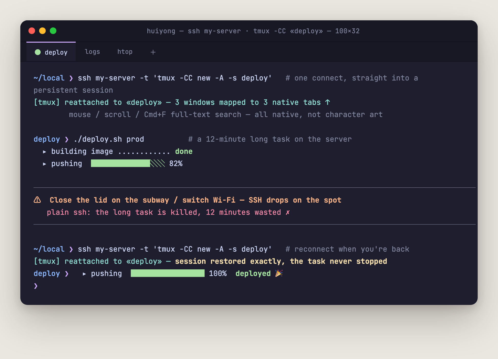
</p>

```bash
ssh server -t 'tmux -CC new -A -s deploy'   # attach if it exists, create if not
```

> ⚠️ **Conflicts with Claude Code's fullscreen mode**: do not use `/tui fullscreen` inside a `-CC` session (scrolling breaks, double buffering corrupts the state — [official note](https://code.claude.com/docs/en/fullscreen)). The default renderer works fine with `-CC`.

### Triggers: automatic log coloring and no typing passwords (installed by default)

`ERROR/FATAL/FAILED` turn red, `WARN/TODO` yellow, `SUCCESS/PASSED` green, and a `Password:` prompt pops your password manager. **The highlight colors come from the current theme and follow every theme switch.**

<p align="center">
  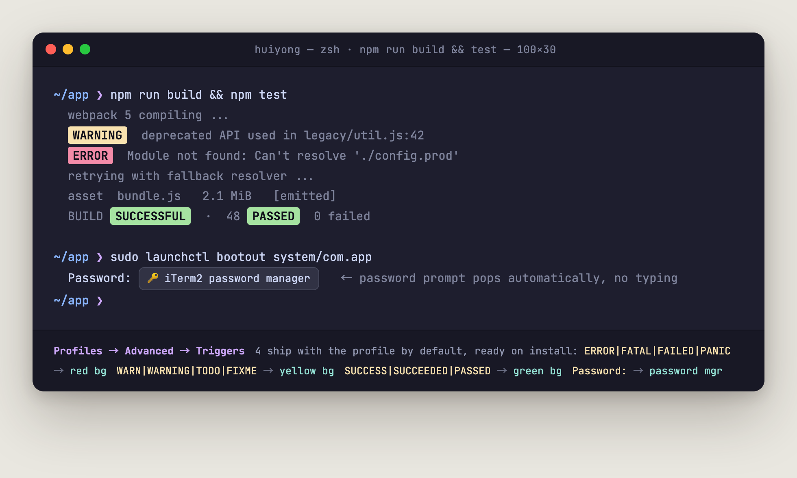
</p>

> Triggers only apply to **newly opened tabs** — right after installing, remember to press `Cmd+T`.

### Shell Integration: images in the terminal, success visible at a glance

`imgcat image.png` shows an image right in the terminal; every command gets a marker on the left (green = success, red = failure), `Cmd+Shift+↑/↓` jumps between command blocks, and `it2copy` on a remote machine copies straight into your local clipboard.

<p align="center">
  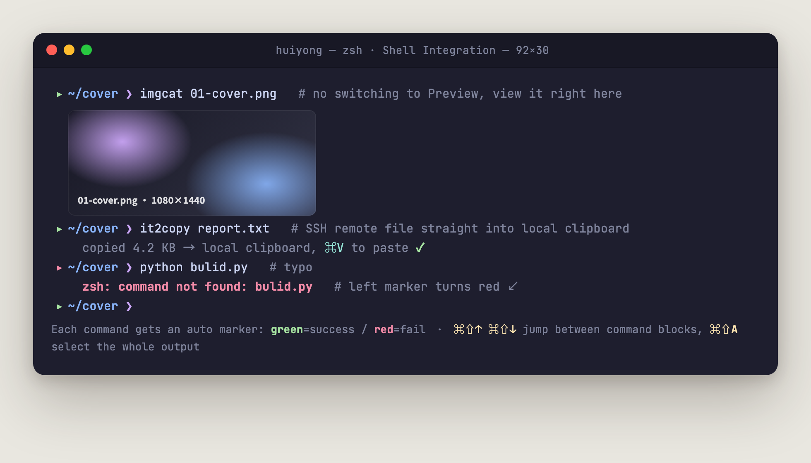
</p>

### How Ghostty / Warp / Terminal.app differ

<p align="center">
  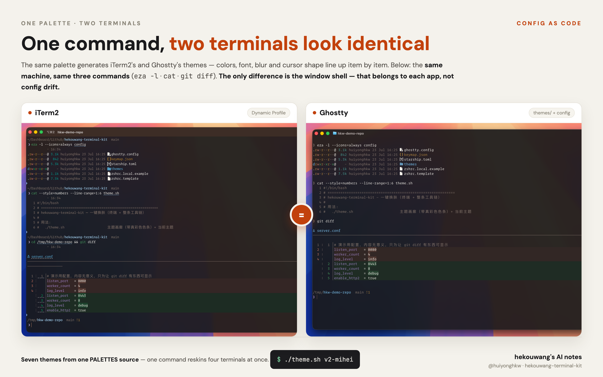
</p>

Above are iTerm2 and Ghostty on the same machine, after the same `./theme.sh`. Colors, font, blur and cursor shape line up item by item — the only difference is the title bar, which belongs to each app's own shell.

Three structural differences worth remembering (the full set of pitfalls is in `references/terminals.md` 〔paid〕):

- A Ghostty **theme only carries colors**; font, blur and cursor live globally in `~/.config/ghostty/config`. iTerm2 packs all of it into one profile
- **Neither Ghostty nor the built-in Terminal applies changes on save**: Ghostty reloads with `Cmd+Shift+,`, and Terminal.app needs a full `Cmd+Q` (it overwrites settings from memory when it quits). Clicking the red dot does not count as quitting
- **The built-in Terminal has only one font field**, without iTerm2's Symbols Nerd Font fallback layer — see the font policy in section 7

> Triggers, the status bar, the toolbelt and tmux `-CC` are iTerm2-only; the other three terminals have no equivalent to sync to.


## 11. One last thing after installing: your private config

SSH aliases, proxy toggles — things that are **yours alone and should never enter a repo** — go into `~/.zshrc.local` (the template loads it automatically, so the repo stays clean):

```bash
open -e ~/.zshrc.local
```

---

## 12. FAQ

<details>
<summary><b>The install stalls on <code>Failed to download</code> / <code>portable-ruby</code> / <code>SSL_ERROR_SYSCALL</code></b></summary>

**Cause**: the download sources on GitHub are unreachable from your network; nothing to do with this setup. Three options, try them top down:

1. **Re-run with `CN=1`** (recommended): `CN=1 ./install.sh`
2. **Just fix Homebrew by hand**:
   ```bash
   export HOMEBREW_API_DOMAIN="https://mirrors.tuna.tsinghua.edu.cn/homebrew-bottles/api"
   export HOMEBREW_BOTTLE_DOMAIN="https://mirrors.tuna.tsinghua.edu.cn/homebrew-bottles"
   export HOMEBREW_BREW_GIT_REMOTE="https://mirrors.tuna.tsinghua.edu.cn/git/homebrew/brew.git"
   export HOMEBREW_CORE_GIT_REMOTE="https://mirrors.tuna.tsinghua.edu.cn/git/homebrew/homebrew-core.git"
   export HOMEBREW_NO_AUTO_UPDATE=1
   ```
3. **You have a proxy**: `export https_proxy=http://127.0.0.1:7890 http_proxy=http://127.0.0.1:7890`
</details>

<details>
<summary><b><code>ls</code> icons show as <code>?</code> boxes / the font is wrong</b></summary>

The icon font did not install, which is common on a restricted network. Re-run `CN=1 ./install.sh` and it gets added.
Section 2 of `./doctor.sh` tells you whether the font name written in the profile resolves — **installed is not the same as on screen**, and iTerm2 falls back silently when the name is wrong.
</details>

<details>
<summary><b>After switching themes, <code>cat</code> still has the old colors</b></summary>

The colors are read when the shell starts, so **open a new window**. To apply it in the current one immediately:
`source ~/.config/hekouwang-terminal/current/colors.sh`
</details>

<details>
<summary><b><code>cat file | head</code> shows no colors at all — looks like nothing worked</b></summary>

**That is correct behaviour, not a fault.** `cat` is an alias for `bat`, and bat — like `ls`, `grep` and `git` — **turns color off the moment its output is not a terminal** (i.e. when a pipe takes it) and emits plain text. So:

```bash
cat ~/.zshrc | head -40                  # ❌ the pipe killed the color; you get grey text
cat --line-range=1:40 ~/.zshrc           # ✅ use bat's own flag, no pipe
bat --color=always ~/.zshrc | head -40   # ✅ or force color on
```

This one is worth money: I tested my own work with `cat file | head` and wasted two rounds before realising **the measurement itself had changed what was being measured**. If you tested it that way too, switch to the second line before drawing conclusions.
</details>

<details>
<summary><b>I changed the Ghostty config / switched themes and Ghostty shows nothing</b></summary>

**Ghostty does not re-read its config automatically, and opening a new tab does not either.** It reads once at app start, or when you explicitly reload — completely unlike iTerm2's live-on-save, and the single most common reason people think nothing happened.

```
In a Ghostty window press   Cmd + Shift + ,
```

Still unchanged? `Cmd + Q` Ghostty completely and reopen it. `./theme.sh` prints this reminder after a switch too.
</details>

<details>
<summary><b>One of the tools failed to install halfway through</b></summary>

The script installs them one at a time and a single failure does not abort the run; at the end it summarises which packages did not install. Follow the hint and `brew install <package>` those — no need to start over.
</details>

<details>
<summary><b>Will I lose my existing terminal config</b></summary>

No. `install.sh` backs `~/.zshrc` up to `~/.zshrc.bak.<timestamp>` before replacing it.
The better path, though, is to run `./migrate.sh` first — it moves your aliases / PATH / env vars into `~/.zshrc.local` rather than overwriting them.
</details>

<details>
<summary><b>How do I switch the language?</b></summary>

Everything defaults to English. Priority is `--lang zh` > `HKW_LANG=zh` > `~/.config/hekouwang-terminal/lang` > English.

```bash
./install.sh --lang zh      # switch and remember the choice
HKW_LANG=zh ./theme.sh      # just this one command
./doctor.sh --lang en       # back to English
```

The `.zshrc` template comes in both languages too (`config/zshrc.template` / `.zh`), so the comments that end up in your home directory are in the language you chose.
</details>

---

## 13. Reference

### Using it as a Claude Code Skill 〔paid〕

The paid pack ships `SKILL.md` / `SKILL.zh-CN.md`, which turn this directory into a Claude Code Skill:

```bash
cp -r hekouwang-terminal-kit ~/.claude/skills/hekouwang-iterm2-skill
```

After that Claude Code triggers it on its own for: restoring a terminal environment on a new Mac, explaining or tuning a `.zshrc`, debugging slow startup, changing colors or adding a theme, syncing Ghostty/Warp, and recommending advanced iTerm2 features — you describe the outcome, the agent runs the right script with the right flags.

**The open-source build has no `SKILL.md`**, and nothing about it is crippled by that: every script is there and you run them yourself (`./theme.sh`, `./doctor.sh`, `./migrate.sh`). What the paid tier adds here is that an agent knows how to run them for you.

---

### Document map

| File | Contents |
|---|---|
| `SKILL.md` 〔paid〕 | Skill entry point + workflows + principles |
| [CHANGELOG.md](../CHANGELOG.md) | Version history |
| [references/zshrc-explained.md](../references/zshrc-explained.md) | `.zshrc` block by block + plugin picks + known issues |
| [references/iterm2-gui-settings.md](../references/iterm2-gui-settings.md) | GUI checklist + Dynamic Profile + advanced features |
| [references/shortcuts.md](../references/shortcuts.md) | Keyboard shortcuts |
| [config/themes/_generate.py](../config/themes/_generate.py) | **Single source of truth**: one palette → every artifact |
| [config/themes/palettes/](../config/themes/palettes/) | Palettes (`community.py` free / `brand.py` paid) |

### Design principles

1. **Config as code** — profiles are JSON, and even the three GUI steps are written with `defaults write`; a new machine needs the files plus one script run.
2. **One palette for the whole chain** — several hand-written palettes always drift (a hand-maintained Warp theme measured 8 of 16 slots wrong). So `_generate.py` produces all of them.
3. **Many themes, one Guid** — switching theme swaps the active file, not the ID, so the default-profile binding never breaks.
4. **Load order is law** — omz → plugins → starship → CLI set → syntax-highlighting second to last → iTerm2 integration last.
5. **Both chips** — paths are detected with `brew --prefix`, so Apple silicon and Intel both work.
6. **Public and private separated** — SSH aliases, proxies and the like live in `~/.zshrc.local`; the repo stays clean.
7. **Anything installable must be uninstallable** — every write has a matching restore path, and each can be previewed with `--dry-run`.

---

### License

**Code: MIT** (see [LICENSE](../LICENSE.txt)) — use it, change it, redistribute it.

**The paid theme pack** (`config/themes/palettes/brand.py`, its generated artifacts and the cheat sheet PDF) is for the buyer's personal use; please do not redistribute it.
Updates are published in the group; if installation gives you trouble, post the error screenshot there.

Third-party components keep their own licenses: Maple Mono (SIL OFL-1.1), Symbols Nerd Font (MIT/OFL), oh-my-zsh (MIT), starship (ISC), and the Catppuccin / Tokyo Night / Gruvbox schemes under their upstream licenses.
**This kit distributes no commercial font files**; Operator Mono and the like must be bought separately, and are detected and used automatically once installed on your machine.

---

<p align="center">
  <b>hekouwang's AI notes</b> · 
  <i>Not whether AI will replace you — how the people already using it will</i> · 
  <i>One person = one team; how?</i> · 
  <i>Anything AI can do, I run for real first and then show you</i>
</p>

<p align="center">
  <sub>"禾口王" put together spells 程 (Cheng) — my family name. This terminal is the one I actually use every day.</sub>
</p>
