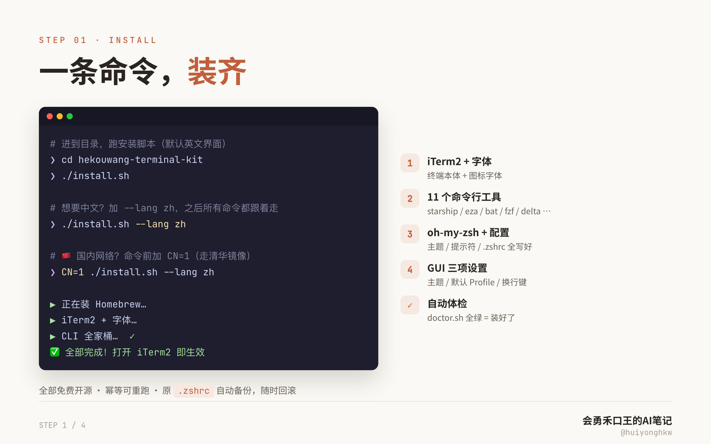
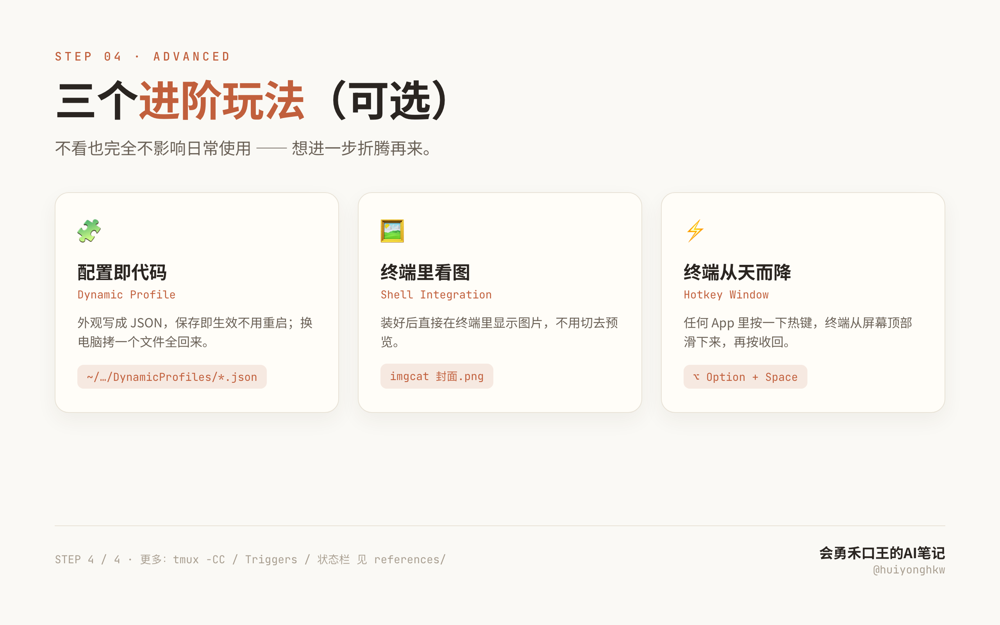
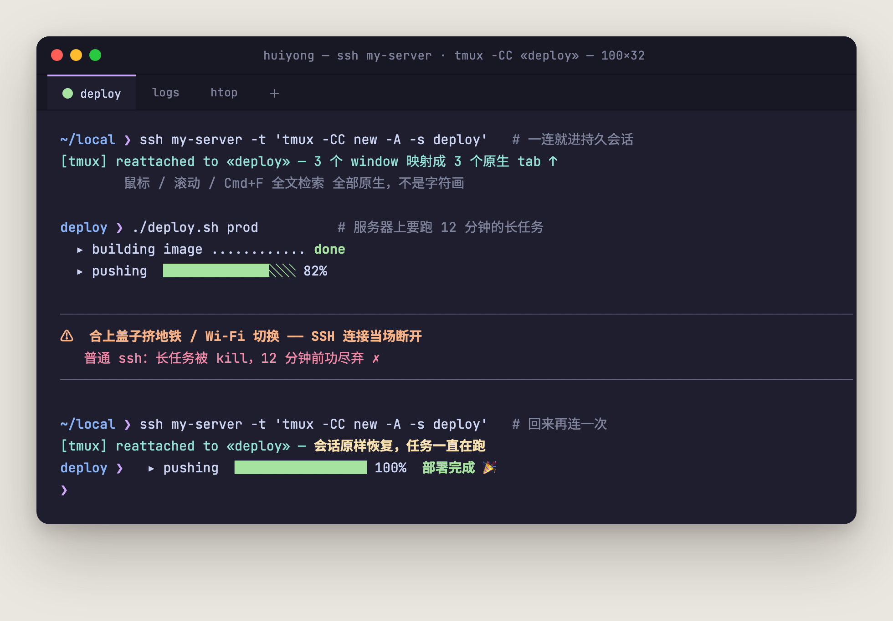
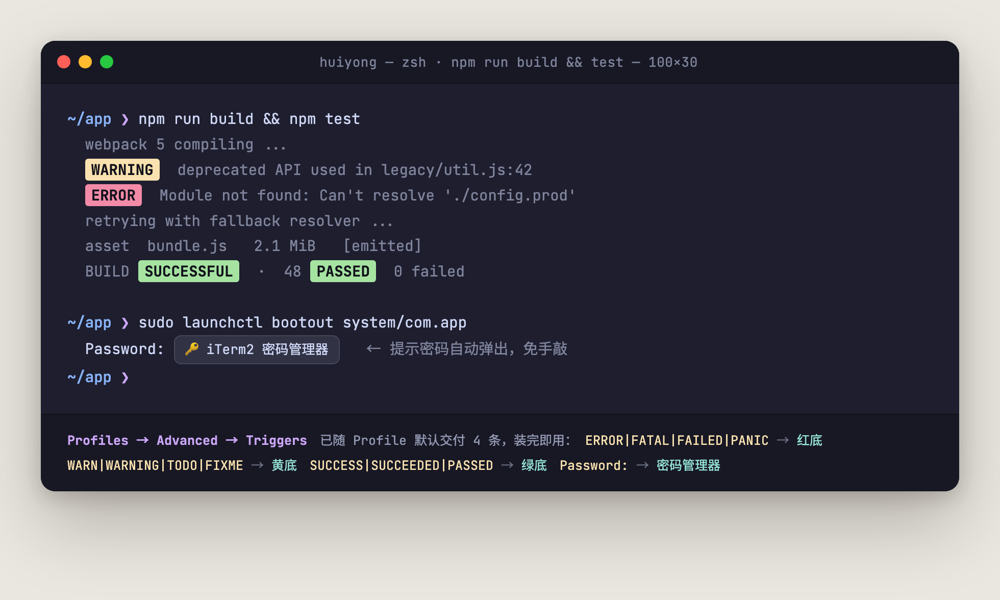
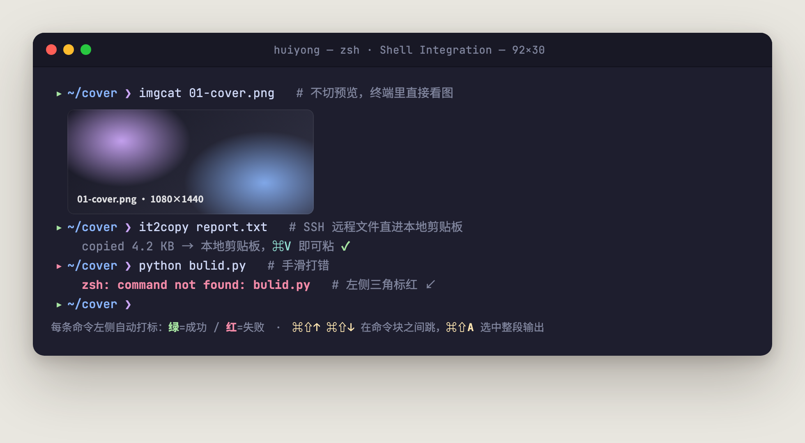
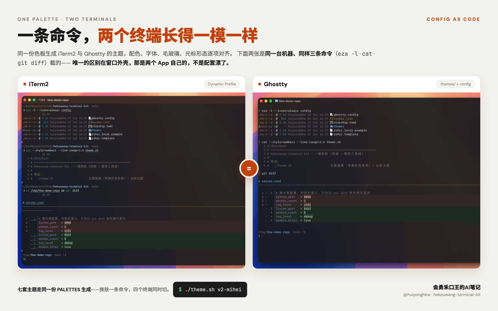

<h1 align="center">hekouwang-terminal-kit</h1>

<p align="center">
  <b>AI 时代的终端，值得重新配一次。</b><br>
  免费版让你的 iTerm2 好看。<br>付费版让这份色板走出 iTerm2——六个终端和整条命令行工具链一起变。
</p>

<p align="center">
  <i>会勇禾口王的AI笔记 · 不聊 AI 会不会取代你，只聊先用 AI 的人怎么取代你</i>
</p>

<p align="center">
  <a href="manual.md">English</a> · <a href="manual.zh-CN.md">简体中文</a>
</p>

<p align="center">
  
  
  
  
</p>

<p align="center">
  
</p>

---

> **完整手册**（含进阶、FAQ、设计原则、文件级分档）。
> **主路径请先看仓库根目录 [`README.zh-CN.md`](../README.zh-CN.md)**——痛点、差异、分档、安装、日常命令都在那里。


## 同一台机器，同一条命令，只差一个档位

<table>
<tr>
<th width="50%">开源版（免费）</th>
<th width="50%">付费版</th>
</tr>
<tr>
<td></td>
<td></td>
</tr>
</table>

一条命令都没变：`eza` 列目录、`cat` 看代码、`git diff` 看改动。

左边**不是「配色难看」**——Monokai 是经典配色，delta 的红绿也是它的出厂设置。
问题是**三个工具各说各的**：`eza` 一套色、`bat` 的洋红一套、`git diff` 的纯红纯绿一套，
而且都跟终端底色不搭。右边这四样是**同一份色板生成的**，所以是一家人。

### 你属于哪一类，决定了这套东西对你值多少

**① 只用 iTerm2 的人 —— 你买的是「不刺眼」**

这个差别很微妙，微妙到**缺了才难受，有了反而无感**。上面那张图就是为你拍的：
不用懂配色，看左边哪里扎眼就知道了。一天在终端里泡八小时，这点差别是会累积的。

**② 用 Ghostty / Warp / cmux / Tabby / macOS 自带终端的人 —— 你买的是「它们跟 iTerm2 说同一种话」**

先把话说清楚：**Ghostty 自己就带 463 套主题**（catppuccin、gruvbox、nord、dracula 都在里面），
一行 `theme = catppuccin-mocha` 就能用，免费。所以这里卖的**不是**「让 Ghostty 有主题」。

卖的是那 463 套解决不了的事：**它们只管 Ghostty**。Ghostty 不知道你 iTerm2 用的是哪套，
更不管 `cat`、`ls`、`git diff`、`tmux`。你换一套配色，得挨个去改。

`./theme.sh v2-mihei` 一条命令：**六个终端 + 整条工具链，同一份色板，一起换。**
下面这对是 Ghostty，跑的是同样三条命令：

<table>
<tr>
<th width="50%">开源版：Ghostty 走自己那套</th>
<th width="50%">付费版：跟 iTerm2 同一份色板</th>
</tr>
<tr>
<td></td>
<td></td>
</tr>
</table>

左边那片刺眼的纯红纯绿，就是「每个工具用自己那套色」的样子。

> 四张图是同一台机器、同一条命令、同一个演示仓拍的，
> 主题 / 字体 / 工具链配色 / Ghostty 主题**四个维度**都按档位对齐，
> 没有给哪一边开小灶。

---

## 一、你可能正在经历的

自从用上 Claude Code 这类 CLI agent，我每天泡在终端里的时间大概翻了一倍。

以前终端是「敲两条命令就切走」的地方。现在它是我和 AI 一起干活的主界面：四个 tab 同时跑着四个任务，输出哗哗往上刷，我得一眼看出哪个报错了、哪个跑完了、哪个还在转。

然后我发现，自己那套用了五年的终端配置，是给「敲命令」设计的，不是给「看 AI 干活」设计的：

- 四个 tab 长得一模一样，切过去半天认不出哪个在跑什么
- agent 吐几百行日志，`ERROR` 和正常输出一个颜色，全靠肉眼扫
- 想给 AI 写个多行 prompt，回车直接就提交了
- 白天靠窗、开会投屏，一片深色底什么都看不清
- 好不容易调顺手，换台电脑全没了，又得从头点一遍

这套配置就是冲着这些来的。**凡是能用 AI 干的活，我先跑通，再演给你看**——这套终端是我自己每天在用的那一套，不是拿来演示的。

## 二、跟网上那些 dotfiles 有什么不一样

1. **一份色板，管到六个终端**〔付费〕。别家换主题只换一个终端的底色。这里 `./theme.sh` 一条命令，iTerm2、Ghostty、Warp、**cmux**、**Tabby**、**macOS 自带终端**一起换，连 `cat`（bat）、`Ctrl+T`（fzf）、`ls`（eza）、`git diff`（delta）、tmux、VS Code 全部同色——因为它们的配色是**同一份色板生成的**，不是各写一遍。手写多套色板一定会漂，这点我用实测数据交过学费：曾经手工维护的 Warp 主题，注释写着「与 iTerm2 完全一致」，实际 16 个色槽错了 8 个。
2. **为 AI 工作流准备的那几处细节**〔开源版就有〕。 `Shift+Enter` 换行不提交（写多行 prompt）；`ERROR/WARN/SUCCESS` 在输出里自动标色；**Cmd-click** `path:line` / Git SHA / `localhost:port`；`Password:` 提示自动弹密码管理器；跟随系统深浅色自动换肤〔付费〕。
3. **敢装，也敢卸**〔开源版就有〕。 `install.sh --dry-run` 先告诉你要改哪些文件、写哪些系统设置、什么绝对不碰；已经有自己的 `.zshrc`？`migrate.sh` 把你的 alias/PATH 搬进 `~/.zshrc.local` 再套模板，而不是盖掉；后悔了 `uninstall.sh` 从备份还原、把 GUI 设置恢复出厂默认。
4. **体检能自己修**〔开源版就有〕。 `doctor.sh --status` 一眼看钉住状态；`--fix` 逐项确认后自动修，`--profile` 直接点名是哪个插件让你的终端开得慢（我自己机器上揪出来的是 `compinit`，258ms）。
5. **它是一个 Claude Code Skill**〔付费〕。别家 dotfiles 给你一堆脚本和一份 README，命令得你自己记。这套装进 `~/.claude/skills/` 之后，你说「白天投屏看不清，换个亮色」「这终端怎么开这么慢」，AI 自己去挑脚本、配参数、跑完、把结果解释给你听——**你描述要什么结果，不用记它怎么做到**。

装完你会得到：

- **好看**：无边框无滚动条、毛玻璃、双行提示符；暗色亮色各有主题
- **好用**：`ls` 带图标、`cat` 自动高亮、`Ctrl+R` 全文搜历史、`z` 一个词跳目录
- **省心**：所有设置都写进文件，**换新电脑跑一遍脚本就全回来**

> 完全不懂命令行也没关系：你只需要会「复制 → 粘贴 → 回车」。

---

## 三、免费版 / 付费版

两条轴：

1. **色板走多远** —— 免费版让你的 iTerm2 好看；付费版让这份色板**走出 iTerm2**：
   Ghostty、Warp、macOS 自带终端、`cat`、`git diff`、tmux、VS Code 全都跟着一起变。
2. **谁在开车** —— 免费版你自己敲 `./theme.sh v2-mibai`、`./doctor.sh --fix`；
   付费版把这套装进 `~/.claude/skills/`，你说「给我换个亮色主题」「我终端怎么开得这么慢」，
   **AI 自己挑脚本、配参数、跑完、解释结果**。

开源版不是演示版：3 套配色、毛玻璃、日志自动标色、`Shift+Enter` 换行、
现代 CLI 全家桶、能自动修的体检、敢让你随时反悔的一键卸载，全都在。
**脚本一个不少、参数一个不改**，第二条轴买的不是功能，是「不用记命令」。

| | 开源版（MIT · 免费） | 付费版 ¥19.9 |
|---|---|---|
| 安装 / 迁移 / 换肤 / 体检 / 更新 / 同步 / 卸载 / GUI 设置 / 分档导出 全套脚本 | ✅ | ✅ |
| Minimal 窗口形态：无标题栏 · 无边框 · 无滚动条 · 无限回滚 | ✅ | ✅ |
| **配色主题** | ✅ 3 套社区（catppuccin-mocha / tokyo-night / gruvbox-dark） | ✅ 3 套社区 **+ 4 套品牌** |
| **质感层**：毛玻璃 · 透明度 · 光标形态 | ✅ | ✅ |
| **Triggers**：ERROR/WARN/SUCCESS 自动标色 + 密码管理器 | ✅ 4 条 | ✅ |
| **语义交互层 v1**：Cmd-click `path:line` / Git SHA / `localhost:port` | ✅ | ✅ |
| **`Shift+Enter` 换行**（AI CLI 写多行 prompt） | ✅ | ✅ |
| 现代 CLI 全家桶 · 体检 `--status`/`--fix`/`--profile` · `.zshrc` 迁移 · 一键卸载 | ✅ | ✅ |
| 主题生成器（自己写色板就出完整 iTerm2 主题） | ✅ | ✅ |
| **Claude Code Skill**：装进 `~/.claude/skills/`，直接跟 AI 说「给我换个亮色主题」「我终端怎么开得这么慢」，它自己把整套跑完 | — | ✅ |
| **品牌主题** | — | V2 米黑 · V1 科技黑 · **V2 米白** · **V3 财经白** |
| **亮色主题**（白天 / 投屏 / 录课 / 户外） | — | ✅ 两套 |
| **多终端同步**：Ghostty · Warp · cmux · Tabby · macOS 自带终端 | — | ✅ 一条命令六个终端 |
| **全生态同色**：bat · fzf · eza · git diff · tmux · VS Code | — | ✅ |
| **字体优先级表**：自动认出你已装的 Operator Mono 等商业字体 | 用推荐默认字体 | ✅ |
| **跟随系统深浅色自动切**（`./theme.sh --auto`） | — | ✅ |
| **项目工作区**：`cd` 进哪个项目，标签页自己变色 + 印项目名 | — | ✅ |
| **色板推导器**：给一个品牌色，算出整套主题 | — | ✅ 无限套主题 |
| **导入现成主题**：Ghostty 自带 463 套 / iTerm2-Color-Schemes 450+ 套，一条命令收编 | — | ✅ 导进来就铺满整条工具链 |
| **A4 可打印《终端速查卡》**（PDF） | — | ✅ |
| 更新与答疑 | GitHub Issues | ✅ 一年内更新 + 群内答疑 |

**为什么这么分**：3 套社区配色本来就是别人的开源作品，收费站不住脚；毛玻璃和 Triggers
是让终端值得被截图的东西，藏起来只会让免费版当不成广告。**付费卖的是我自己做的那三件事**——
从品牌 token 推导的四套主题、「一份色板管住整条工具链」的那套生成器，
以及**把这套东西教会 AI 的那份 Skill**（写清楚每条工作流、每个坑、每个判据，
让它不用你解释就知道该跑哪个脚本、带什么参数、结果怎么读）。
配色能换、代码能重写，这三样都是拿时间换出来的。

**想要付费版** → **[huiyonghkw.github.io/hekouwang-terminal-kit](https://huiyonghkw.github.io/hekouwang-terminal-kit/)**
（那一页有收款码和交付方式）。¥19.9，一年内更新免费 + 答疑，
**七天内不合用直接退，不问原因**。先装开源版用两天再决定也完全可以 —— 它不是试用版，
是你不买也能一直用下去的完整产品。

> 也可以直接加微信 **`hekouwang`**（备注「终端套装」）。

**技术上怎么分的**（摆在明面上，不搞解锁码）：

| 免费（开源仓里就有） | 付费（在付费包里） |
|---|---|
| `_generate.py` —— 完整 iTerm2 主题（配色 + 质感层 + Triggers + 状态栏） | `generators/pro.py` —— 多终端 + 全生态生成器 |
| `palettes/community.py` —— 3 套社区色板 | `palettes/brand.py` —— 4 套品牌色板 |
| `config/keymap.json` —— 全局键映射 | `config/font.conf` —— 字体优先级表 |
| | `palettes/_derive.py` —— 色板推导器 |
| | `palettes/_import.py` —— 现成主题导入引擎 |
| | `SKILL.md` / `SKILL.zh-CN.md` —— Claude Code Skill |

付费件不在时，生成器**照常出完整的 iTerm2 主题**，只是明确打印「以下属付费包，当前不生成」，
不报错也不留半成品。

四套品牌主题不是挑了几个好看的颜色，是从品牌 token 按一套方法推的：色相取自 token、
明度用 WCAG 对比度反解（正文 5.5:1 / 强调 9:1）、饱和按各版性格定，两套亮色的 ANSI 是**算出来的**。

<details>
<summary>付费版怎么拿、怎么装（两条路，选一条）</summary>

**路一 · zip 包（默认，不需要 GitHub 账号）**

```bash
cd ~/hekouwang-terminal-kit
./unlock.sh ~/Downloads/hekouwang-terminal-kit-付费包-*.zip
```

一条命令：校验完整性 → 解压 → 重新生成全部主题 → 重新部署（顺带给 bat 建缓存）。
想先看它要做什么：加 `--dry-run`。只装不切主题：加 `--no-apply`。

**路二 · private 仓（会用 git 的话更省事）**

买完把 GitHub 用户名发我（微信 `hekouwang`），我把你加进私有仓 `hekouwang-terminal-kit-pro` 的协作者。
之后：

```bash
git clone git@github.com:huiyonghkw/hekouwang-terminal-kit-pro.git
cd hekouwang-terminal-kit-pro && ./install.sh
# 以后拿更新：
git pull && cd config/themes && python3 _generate.py && cd ../.. && ./theme.sh v2-mihei
```

私有仓是**免费仓的超集**，clone 它一个就够了，不用再 clone 免费仓。

> 第一次切到某套主题时会停几秒给 bat 建缓存，属正常 —— 这步不能省，
> bat 认不出主题时不报错，而是静默用它自己的默认配色（表现为「只有 `cat` 的颜色不对」）。
</details>

---

## 四、装

### 一、三个前置条件

1. **一台 Mac**（Apple 芯片或 Intel 都行，脚本会自动识别）。
2. **能联网**。国内网络可能连不上 GitHub，本节末尾有专门的国内加速办法。
3. **会打开「终端」**：按 `Command + 空格`，输入 `Terminal` 回车。第一次安装在这个自带终端里做；装完改用 iTerm2。

<p align="center">
  
</p>

**这份文档怎么读**：装机看第四节，日常用看第六、七节，AI 工作流看第八节，出问题看第九、十二节，其余按需翻。

---

<p align="center">
  
</p>

### 二、先分清你是哪种情况

| 你的情况 | 用哪个 |
|---|---|
| 新 Mac，或从来没配过 `~/.zshrc` | `./install.sh` |
| **已经在用自己的 `.zshrc`**（有攒下来的 alias / PATH / 公司环境变量） | 先 `./migrate.sh` |

`install.sh` 是拿模板**覆盖** `~/.zshrc` 的（会先备份）。你要是已经用了几年，直接覆盖等于一次性全丢——虽然能从 `.bak` 捞回来，但得自己一行行挑。`migrate.sh` 就是干这件事的：把你自己的东西挑出来搬进 `~/.zshrc.local`（模板会自动加载它），再套模板。

```bash
./migrate.sh            # 先看报告：哪些会搬走、哪些会丢、为什么
./migrate.sh --apply    # 确认没问题再执行
```

### 三、开装

```bash
# 情况 A：拿到的是压缩包
unzip hekouwang-terminal-kit-*.zip -d ~/hekouwang-terminal-kit
cd ~/hekouwang-terminal-kit && ./install.sh

# 情况 B：从 GitHub 拉
git clone https://github.com/huiyonghkw/hekouwang-terminal-kit.git
cd hekouwang-terminal-kit && ./install.sh
```

**不放心？先干跑一遍**，它会把「要装什么、要写哪些文件、要改哪些系统设置、什么绝对不碰」原样列给你，一个字节都不动：

```bash
./install.sh --dry-run
```

### 四、国内网络：命令前加 `CN=1`

国内又没开科学上网的话，直接装大概率卡在下载（报 `portable-ruby`、`SSL_ERROR_SYSCALL` 之类）。**把启动命令换成这句**，自动切国内镜像（清华 TUNA + gitee）：

```bash
CN=1 ./install.sh
```

### 五、跑的时候它在干嘛？

> Homebrew → iTerm2 + 字体 → CLI 工具 → oh-my-zsh → 主题与配色（**全生态同色属付费档**） → bat 主题 → 挂进 git/tmux → 编辑器主题 → `.zshrc` → Shell Integration → 系统设置 → 导入历史 → **自动写好 GUI 三项设置** → 自检报告

跑完看到 `✅ 全部完成！` 就成了。最后会自动跑一遍 `doctor.sh`，**全绿就代表装好了**：

<p align="center">
  
</p>

> ⚠️ 这张图拍的是**付费档**的机器，所以第 5 节「全生态同色」那八行是绿的。
> **开源版这一节不会全绿，也不是装坏了**——多终端与全生态同色属付费包，
> `doctor.sh` 明确不把它当故障（缺了不报警）。开源版的判据是第 1～4、6～8 节绿。

**关掉自带终端，打开 iTerm2**，新界面就生效了。

> 💡 脚本是幂等的，重跑安全；`~/.zshrc` 覆盖前会备份进 `~/.hekouwang-terminal-backups/`。

---

## 五、装完为什么就好看了

<p align="center">
  
</p>

这一步**你什么都不用做**——以前要手动进设置面板点的 3 个地方，脚本已经用 `defaults write` 帮你写好了：

1. **主题 = Minimal**：去掉标题栏、边框和滚动条，整窗是一块干净画布，带一点毛玻璃。
2. **配色**：不是抄来的社区主题——色相取自品牌色板，明度按 WCAG 对比度反解（正文 5.5:1、强调 9:1），所以既克制又读得清。
3. **字体 = Maple Mono NF CN**（推荐默认）：等宽 + **自带 Nerd Font 图标 + 中文等宽**，一套顶过去「主字体 + 图标字体」两套，`ls` 的图标永远不会变成 `?` 方块。
   > 授权说明：Maple Mono 是 SIL OFL-1.1，**免费可商用可分发**。旧版本曾捆绑 Operator Mono（H&Co 商业字体，第三方仓库分发），2.0 起已移除——**本套装不分发任何字体文件**。
   > 付费版另有一张[字体优先级表](#字体认你已有的不替你装)，会自动认出你已装的 Operator Mono 等商业字体并用上；开源版固定用这个推荐默认。

---

## 六、每天用的那几个命令

<p align="center">
  
</p>

| 工具 | 一句话 | 怎么用 |
|---|---|---|
| **starship** | 漂亮的提示符 | 自动显示：在哪个目录、git 哪个分支、上条命令跑了多久 |
| **eza**（替代 `ls`） | 文件列表带彩色图标 | 直接敲 `ls` |
| **bat**（替代 `cat`） | 看文件自动高亮 + 行号 | 直接敲 `cat 文件名` |
| **delta**（替代 git 的 diff） | diff 带语法高亮和行号 | 直接敲 `git diff` |
| **fzf** | 模糊搜一切 | `Ctrl+T` 搜文件，`Alt+C` 模糊 cd |
| **zoxide**（替代 `cd`） | 一个词跳目录 | `z 关键词`，越用越准 |
| **atuin** | 全文搜历史命令 | `Ctrl+R`，几个月前敲过的也能搜到 |

还有给 AI 用的一条：**`Shift + Enter` 在终端里换行不提交**——用 Claude Code 这类工具输入多行时很顺手。

<p align="center">
  
</p>

> 全部快捷键见 [`references/shortcuts.md`](../references/shortcuts.md)；付费版另有一页 A4 速查卡可打印。

---

## 七、换肤：一条命令，六个终端 + 整条工具链

```bash
./theme.sh                 # 主题画廊：每套一行，带真彩色 16 色条、标出当前用的哪套
./theme.sh tokyo-night     # 切主题
./theme.sh --preview v2-mihei   # 不换肤，先看这套长什么样（整块「假终端」）
./theme.sh --gallery            # 七套挨个渲一遍
```

`--preview` 出的是一整块预览：提示符、`eza` 文件列表、`git diff`、语法高亮、
ERROR/WARN 自动标色全在一张图里。它用 24 位真彩色画，**跟你当前用的是哪套主题无关** ——
所以挑主题不用先换一遍，截图也不用换七次肤。

切一次，下面这些**同时**变成同一套色：

| 层 | 换掉什么 |
|---|---|
| **iTerm2** | Dynamic Profile（保存即生效，无需重启）+ 字体 |
| **Ghostty** | 主题文件 + `theme=` 行 + 字体（含 `font-style`） |
| **Warp** | 同名同色主题，`./theme.sh` 直接切（改 `~/.warp/settings.toml`，Warp 里没变就重启它） |
| **macOS 自带终端** | 生成 Profile 写进 `com.apple.Terminal` 并设为默认，含 16 色 + 字体 + 透明度 |
| **bat** | `cat` 的语法高亮 |
| **fzf** | `Ctrl+T` 弹窗配色 |
| **eza / ls** | 文件列表配色（`LS_COLORS` + `EZA_COLORS`） |
| **delta** | `git diff` 的增删底色、行号、文件头 |
| **tmux** | 状态栏、边框、消息条 |
| **VS Code / Cursor** | 同名主题扩展（含终端面板的 16 色） |

> starship 不在表里，因为它本来就跟着走——它的 style 用的是 ANSI 色名（`blue`/`purple`/`bright-black`），换肤自动同步。生成 hex 反而会把它钉死。

**同步不过去的**（这几个是 iTerm2 独有的，别的终端没有对应物）：Triggers（日志自动标色/密码提示）、Dynamic Profile 热加载、工具带、tmux `-CC` 原生映射。

### 字体：认你已有的，不替你装

字体走 `config/font.conf`〔付费〕 的**优先级表**，部署时探测本机实际装了哪套，第一个命中的采用——iTerm2、Ghostty、自带终端三处写同一个结果。

```
OperatorMono-Book|Operator Mono|Book|H&Co 商业字体，需自购授权
MapleMono-NF-CN-Regular|Maple Mono NF CN||SIL OFL-1.1，免费可商用，自带图标与中文
JetBrainsMono-Regular|JetBrains Mono||Apache-2.0，兜底
```

**本套装不分发任何字体文件。** Operator Mono 这类商业字体（约 $199）你自己买过、装在本机上，这里就自动用上；没有的人自动落到 Maple Mono NF CN。想换别的字体，在表最上面加一行，重跑 `./theme.sh` 即可。

> 为什么要探测而不是写死一个名字：字体名写错时 iTerm2 和 Ghostty 都是**静默回退到系统字体**，不报错。`./doctor.sh` 第 2 节会告诉你最终用的是哪套、以及 Profile 里写的名字能不能被解析到。
> 另：两个 App 取名口径不同——iTerm2 要 PostScript 名（`OperatorMono-Book`），Ghostty 要 family 名（`Operator Mono`）+ `font-style`。表里两列都存着，别互相抄。

### 跟随系统深浅色自动切 <sub>（付费版 · 默认关）</sub>

跟随系统**默认关闭**。手动 `./theme.sh <主题>` 会钉住该主题；若当时开着跟随，会自动关掉，避免「配了黑色被系统浅色顶回白色」。

```bash
./theme.sh --auto                       # 明确想跟系统时再开（深色→V2米黑，浅色→V2米白）
./theme.sh --auto v1-keji v3-caijing-bai # 自己指定配对
./theme.sh --auto off                   # 关掉
```

原理：macOS 切深浅色时会写 `~/Library/Preferences/.GlobalPreferences.plist`，装一个 launchd 代理监听这个文件即可。日落自动换亮色、开会投屏自动跟着系统走。

### 加自己的主题

改 `config/themes/palettes/` 下的色板文件，重跑 `python3 _generate.py`，全套产物自动重出。**别手改生成出来的 JSON / YAML / tmTheme**，下次重跑就没了。

新建 `palettes/mine.py`，里面写一个 `PALETTES = {...}` 就会被自动发现：

```python
PALETTES = {
    "my-theme": {
        "display": "我的主题", "light": False,
        "bg": "1a1a1a", "fg": "eeeeee", "cursor": "ff8800",
        "selbg": "333333", "selfg": "eeeeee",
        "ansi": [...16 个 hex...],   # black red green yellow blue magenta cyan white ×2
    },
}
```

---

## 八、为 AI 工作流准备的三件事 <sub>（付费）</sub>

这三样都是从同一个场景来的：**四个 tab 同时跑着四个 agent**。

### 项目工作区：一眼分清哪个 tab 在跑什么

```bash
./workspace.sh add ~/code/我的项目      # 登记
./workspace.sh                          # 看已登记的
./workspace.sh remove 我的项目          # 取消
```

登记之后，`cd` 进那个目录，**标签页自己变色**，窗口右上角还印着项目名。

颜色不是随便挑的——从当前主题调色板的 bright 行轮转取，所以永远在同一套色系里，
换肤时这些变体自动跟着重出，不用重新登记。每个变体只覆盖 3 个标识键，其余全继承主题。

> 原理是 iTerm2 的 Automatic Profile Switching。⚠️ 需要两个前提：
> ① 装了 Shell Integration（`install.sh` 会装，APS 靠它上报路径）；
> ② iTerm2 的自动切换总开关已开——`./workspace.sh` 会替你检查并给出开启命令。


### 色板推导器：给一个色，算出一整套

```bash
./palette.sh --from "#e08a5f" --name 我的主题 --preset 编辑
./palette.sh --from "#1a73e8" --name 财经白 --light --preset 数据
```

它不是调色工具，是把**四套品牌主题背后那套方法**固化成了代码：色相取自你的品牌色，
明度用 WCAG 对比度**反解**（normal 5.5:1 / bright 9:1），饱和按性格定，中性灰锁在同一色相上。

推完得到一份 `palettes/<名字>.py`，重跑生成器就出全套——含多终端与整条工具链。
所以付费版给的不是「4 套主题」，是**无限套 + 一套能复用的推导方法**。

---

## 九、维护：体检 / 更新 / 多机同步 / 卸载

### 体检 + 自动修

```bash
./doctor.sh              # 纯只读；第 0 节＝状态机仪表盘
./doctor.sh --status     # 只看仪表盘：主题 / 跟随 / Node / 语义 / Ghostty 重载
./doctor.sh --fix        # 逐项问你要不要修（每项先说清楚要跑什么命令）
./doctor.sh --profile    # 终端开得慢？直接点名是哪个插件占的时间
```

体检覆盖：CLI 工具是否齐、字体**是否真的能被解析到**（写错名字时 iTerm2 会静默回退，肉眼看不出来）、Dynamic Profile 是否合法与 Guid 是否冲突、GUI 设置、**全生态配色是否真的一致**、`.zshrc` 加载顺序、Node 管理器冲突、**shell 启动耗时**（7 次取中位数）。

---

### 更新

```bash
./update.sh --check   # 有没有新版本？这次更了什么？（不动任何东西）
./update.sh           # 拉更新 → 重新生成主题 → 重新部署当前主题
```

### 多机同步

```bash
./sync.sh             # 这台机器的配置和仓库还一致吗（只读）
./sync.sh --pull      # 把漂掉的对回来
./sync.sh --export    # 打个包带去第二台机器
```

### 卸载

```bash
./uninstall.sh --dry-run   # 先看它打算删什么
./uninstall.sh             # 逐项确认后还原
```

**`uninstall.sh` 的四条底线**（和 `install.sh` 是一对）：

1. 只删本套装自己装的东西。Homebrew 本体、oh-my-zsh、你的 `~/.zshrc.local`、你自己的 git/ssh 配置，一律不碰（除非你显式勾）。
2. `~/.zshrc` 从备份**还原**，不是删掉了事；找不到备份就明说，不假装成功。
3. iTerm2 的 GUI 设置用 `defaults delete` 还原成**出厂默认**，而不是写一个「我们以为的默认值」——后者只是换一种方式改你的配置。
4. 删之前先打印清单，`--dry-run` 跑完能看到一模一样的清单。

---

## 十、进阶玩法（可选）

<p align="center">
  
</p>

- **Dynamic Profile（配置即代码）**：iTerm2 外观写成 JSON，保存即生效、不用重启；换电脑拷这个文件就全回来。
- **Hotkey Window**：在任何 App 里按一下热键，终端从屏幕顶部滑下来，再按一下收回去。

### ⭐ tmux -CC：SSH 断线不丢会话

iTerm2 独家的 `-CC` 控制模式：远程 tmux 的每个 window 直接映射成**原生** iTerm2 tab/分屏（鼠标、滚动、`Cmd+F` 全文检索全是原生）。合盖、换 Wi-Fi、地铁断网——**远程会话不丢**。

<p align="center">
  
</p>

```bash
ssh server -t 'tmux -CC new -A -s deploy'   # 有就接管、没有就新建
```

> ⚠️ **和 Claude Code 全屏模式冲突**：`-CC` 会话里别开 `/tui fullscreen`（滚轮失灵、双击损坏状态，[官方说明](https://code.claude.com/docs/en/fullscreen)）。默认渲染器 + `-CC` 照常用。

### Triggers：日志关键词自动标色 + 密码免手敲（已默认装好）

`ERROR/FATAL/FAILED` 自动标红、`WARN/TODO` 标黄、`SUCCESS/PASSED` 标绿，`Password:` 提示自动弹密码管理器。**标注色取自当前主题，换肤时自动跟着变。**

<p align="center">
  
</p>

> Triggers 只对**新开的 tab** 生效——刚装好记得 `Cmd+T`。

### 语义交互层 v1：Cmd-click 路径 / SHA / 端口（已默认装好）

Triggers 解决「愿不愿意看」；语义层解决「少操作几步」——报错里的 `src/app.ts:42`、日志里的 commit SHA、`localhost:3000`，**Cmd-click 就能打开或执行动作**。

| 匹配 | Cmd-click（第一条动作） | 右键还可 |
|---|---|---|
| `path/to/file.ext:42` 或 `:42:8` | 用本机最佳编辑器打开到行（Cursor / VS Code …） | Copy path:line |
| Git SHA（`[0-9a-f]{7,40}`） | 在仓库目录跑 `git show --stat` | Copy SHA |
| `localhost:3xxx` / `127.0.0.1:…` | 浏览器打开 | Copy host:port |

四击（quad-click）按 Smart Selection 选中整段。Semantic History 设为 `best editor`。

```bash
./theme.sh <当前主题>    # 升级后重部署
# 然后 Cmd+T 新开 tab —— Smart Selection 只对新会话生效
./doctor.sh --status     # semantic 行应显示产品规则 + SH=best editor
```

文档站深链（可分享）：[语义交互层](https://huiyonghkw.github.io/hekouwang-terminal-kit/guide/semantic.html)

> ⚠️ **只在 iTerm2 里有**：Ghostty / Warp / cmux / Tabby / 自带终端没有 Smart Selection 对应物——和 Triggers 同一条诚实边界。付费档的多终端同步管的是配色观感，不是可点语义。

### Shell Integration：终端里看图 + 命令成败一眼可见

`imgcat 图.png` 直接在终端显示图片；每条命令左侧自动打标（绿=成功 / 红=失败），`Cmd+Shift+↑/↓` 在命令块间跳；SSH 远程机上 `it2copy` 直进本地剪贴板。

<p align="center">
  
</p>

### Ghostty / Warp / cmux / Tabby / 自带终端的差异

<p align="center">
  
</p>

上图两侧是同一台机器上的 iTerm2 与 Ghostty，跑的是同一条 `./theme.sh`。配色、字体、毛玻璃、光标形态逐项对齐——唯一差别在标题栏，那是两个 App 自己的外壳。

三点结构差异值得记（完整踩坑见 `references/terminals.md`〔付费〕）：

- Ghostty 的**主题只管颜色**，字体/毛玻璃/光标在 `~/.config/ghostty/config` 里全局一份；iTerm2 是全塞进一个 Profile
- **Ghostty 和 macOS 自带终端都不会保存即生效**：Ghostty 按 `Cmd+Shift+,` 重载，自带终端要 `Cmd+Q` 完全退出（它退出时会用内存配置覆盖）。点红叉不算退出
- **自带终端只有一个字体字段**，没有 iTerm2 那层 Symbols Nerd Font 兜底 —— 见第七节的字体策略

> Triggers、状态栏、工具带、tmux `-CC` 是 iTerm2 独有的，其它三个终端没有对应物，同步不过来。


## 十一、装完最后一件事：填你的私有配置

SSH 服务器别名、代理开关这类**只属于你自己、不该进仓库**的东西，统一写进 `~/.zshrc.local`（模板会自动加载它，仓库永远保持干净）：

```bash
open -e ~/.zshrc.local
```

---

## 十二、常见问题

<details>
<summary><b>安装卡在 <code>Failed to download</code> / <code>portable-ruby</code> / <code>SSL_ERROR_SYSCALL</code></b></summary>

**原因**：国内网络连不上 GitHub 的下载源，跟这套配置本身无关。三选一，从上往下试：

1. **重跑时加 `CN=1`**（推荐）：`CN=1 ./install.sh`
2. **只想手动修 Homebrew**：
   ```bash
   export HOMEBREW_API_DOMAIN="https://mirrors.tuna.tsinghua.edu.cn/homebrew-bottles/api"
   export HOMEBREW_BOTTLE_DOMAIN="https://mirrors.tuna.tsinghua.edu.cn/homebrew-bottles"
   export HOMEBREW_BREW_GIT_REMOTE="https://mirrors.tuna.tsinghua.edu.cn/git/homebrew/brew.git"
   export HOMEBREW_CORE_GIT_REMOTE="https://mirrors.tuna.tsinghua.edu.cn/git/homebrew/homebrew-core.git"
   export HOMEBREW_NO_AUTO_UPDATE=1
   ```
3. **有科学上网工具**：`export https_proxy=http://127.0.0.1:7890 http_proxy=http://127.0.0.1:7890`
</details>

<details>
<summary><b><code>ls</code> 的图标变成 <code>?</code> 方块 / 字体不对</b></summary>

图标字体没装上，国内网络常见。重跑 `CN=1 ./install.sh` 即可补上。
跑 `./doctor.sh` 第 2 节会告诉你 Profile 里写的字体名能不能被解析到——**装了不等于上屏**，字体名写错时 iTerm2 是静默回退的。
</details>

<details>
<summary><b>Cmd-click 路径 / SHA / 端口没反应</b></summary>

语义交互层随 Profile 交付，但有四条常见漏点：

1. **换肤后没新开 tab** —— Smart Selection 只对新会话生效，按 `Cmd+T`
2. **升级后没重部署** —— `./theme.sh <当前主题>`，再新开 tab
3. **Cmd-click 被关了** —— `./doctor.sh` 会查 `CommandSelection`；或跑 `./setup-gui.sh`（需在 iTerm2 外执行）
4. **本机没装编辑器** —— Semantic History = `best editor`，至少装 VS Code / Cursor 之一

先看 `./doctor.sh --status` 的 `semantic` 行。详解：[语义交互层](https://huiyonghkw.github.io/hekouwang-terminal-kit/guide/semantic.html)
</details>

<details>
<summary><b>换肤之后 <code>cat</code> 的颜色没变</b></summary>

配色是在 shell 启动时读的，**新开一个窗口**即可。想在当前窗口立刻生效：
`source ~/.config/hekouwang-terminal/current/colors.sh`
</details>

<details>
<summary><b><code>cat 文件 | head</code> 看不到任何配色 —— 以为没生效</b></summary>

**这是对的，不是故障。** `cat` 是 `bat` 的别名，而 bat 跟 `ls`、`grep`、`git` 一样，
**一发现输出不是终端（被管道接走了）就自动关掉颜色**，吐纯文本。所以：

```bash
cat ~/.zshrc | head -40      # ❌ 管道把颜色杀了，看到的是灰白一片
cat --line-range=1:40 ~/.zshrc   # ✅ 用 bat 自己的参数，不走管道
bat --color=always ~/.zshrc | head -40   # ✅ 或者强制开色
```

这个坑很值钱：我自己验收时就是拿 `cat 文件 | head` 试的，白折腾了两轮才反应过来
**测量手段本身把被测对象改了**。你要是也这么试过，先换成上面第二条再下结论。
</details>

<details>
<summary><b>改了 Ghostty 配置 / 换了主题，Ghostty 里没反应</b></summary>

**Ghostty 不会自动重读配置，开新标签也不会。** 它只在 App 启动时或你显式重载时读一次
—— 这跟 iTerm2 的「保存即生效」完全不同，是最容易让人误判「没生效」的一处。

```
在 Ghostty 窗口里按   Cmd + Shift + ,
```

还不变就 `Cmd + Q` 完全退出 Ghostty 再打开。`./theme.sh` 换肤后也会提示这一句。
</details>

<details>
<summary><b>装到一半某个工具失败了</b></summary>

脚本是逐个安装、单个失败不中断的，最后会汇总「这些包没装上」。照提示 `brew install 包名` 补装即可，不用从头再来。
</details>

<details>
<summary><b>怎么切语言</b></summary>

全线默认英文。优先级：`--lang zh` > `HKW_LANG=zh` > `~/.config/hekouwang-terminal/lang` > 英文。

```bash
./install.sh --lang zh      # 切中文并记住
HKW_LANG=zh ./theme.sh      # 只让这一条命令说中文
./doctor.sh --lang en       # 切回英文
```

`.zshrc` 模板也分两种语言（`config/zshrc.template` / `.zh`），
所以落进你家目录的那些注释，是你选的那种语言。
</details>

<details>
<summary><b>我原来的终端配置会丢吗</b></summary>

不会。`install.sh` 覆盖 `~/.zshrc` 前会备份进 `~/.hekouwang-terminal-backups/`。
但更好的做法是先跑 `./migrate.sh`——它把你的 alias/PATH/环境变量搬进 `~/.zshrc.local` 而不是覆盖掉。
</details>

---

## 十三、参考

### 作为 Claude Code Skill 使用 〔付费〕

付费包里带 `SKILL.md` / `SKILL.zh-CN.md`，把这个目录变成一个 Claude Code Skill：

```bash
cp -r hekouwang-terminal-kit ~/.claude/skills/hekouwang-iterm2-skill
```

之后在 Claude Code 里它会自己触发：新 Mac 还原终端环境、解读/优化 `.zshrc`、排查启动慢、改配色或加主题、给 Ghostty/Warp 同步、推荐 iTerm2 高阶功能 —— 你说要什么结果，它去挑脚本、配参数、跑完。

**开源版没有 `SKILL.md`**，但没有任何功能因此残废：脚本一个不少，只是你自己敲（`./theme.sh`、`./doctor.sh`、`./migrate.sh`）。付费档在这里多出来的是「AI 会用它」。

---

### 文档导航

| 文件 | 内容 |
|---|---|
| `SKILL.md` 〔付费〕 | Skill 入口 + 使用流程 + 关键原则 |
| [CHANGELOG.md](../CHANGELOG.md) | 版本变更 |
| [references/zshrc-explained.md](../references/zshrc-explained.md) | `.zshrc` 逐块详解 + 插件推荐 + 已知问题修复 |
| [references/iterm2-gui-settings.md](../references/iterm2-gui-settings.md) | GUI 设置清单 + Dynamic Profile + 高级功能 |
| [references/shortcuts.md](../references/shortcuts.md) | 快捷键速查表 |
| [config/themes/_generate.py](../config/themes/_generate.py) | **唯一真相源**：一份色板 → 全生态产物 |
| [config/themes/palettes/](../config/themes/palettes/) | 色板（`community.py` 开源 / `brand.py` 付费） |

### 设计原则

1. **配置即代码** —— Profile 用 JSON 管理，连 GUI 三步也用 `defaults write` 写；换机拷文件 + 跑脚本就还原。
2. **一份色板管全链路** —— 多套色板各自手写就一定会漂（实测手工维护的 Warp 主题 16 槽错 8 个）。所以全部由 `_generate.py` 出。
3. **多主题一个 Guid** —— 切主题=换激活文件不换 ID，默认 Profile 绑定永不断。
4. **加载顺序铁律** —— omz → 插件 → starship → CLI 套件 → syntax-highlighting 倒数第二 → iTerm2 integration 最后。
5. **跨芯片** —— 用 `brew --prefix` 探测路径，Apple Silicon / Intel 通吃。
6. **公私分离** —— SSH 别名、代理等放 `~/.zshrc.local`，仓库永远干净。
7. **能装就要能卸** —— 每个写操作都有对应的还原路径，且都能 `--dry-run` 预演。

---

### 许可

**代码：MIT**（见 [LICENSE](../LICENSE.txt)），随便用、随便改、随便分发。

**付费主题包**（`config/themes/palettes/brand.py` 及其生成物、速查卡 PDF）：仅供购买者个人使用，请勿二次分发。
更新会在群内同步发布；安装遇到问题，群内发报错截图即可。

第三方组件各依其原始许可：Maple Mono（SIL OFL-1.1）、Symbols Nerd Font（MIT/OFL）、oh-my-zsh（MIT）、starship（ISC）、Catppuccin / Tokyo Night / Gruvbox 配色各依其上游许可。
**本套装不分发任何商业字体文件**；Operator Mono 等需自购授权，装在本机后会被自动识别使用。

---

<p align="center">
  <b>会勇禾口王的AI笔记</b> · 
  <i>不聊 AI 会不会取代你，只聊先用 AI 的人怎么取代你</i> · 
  <i>一个人 = 一支团队，怎么做到？</i> · 
  <i>凡是能用 AI 干的活，我先跑通，再演给你看</i>
</p>

<p align="center">
  <sub>「禾口王」拼起来是「程」。这套终端是我每天真在用的那一套。</sub>
</p>
